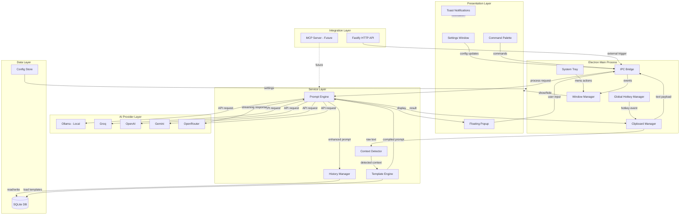
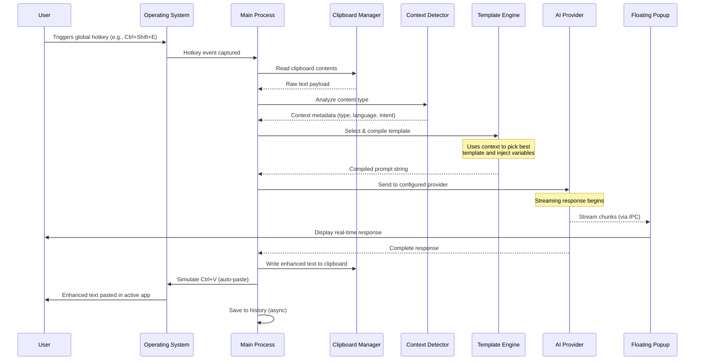
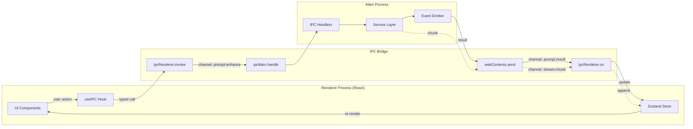
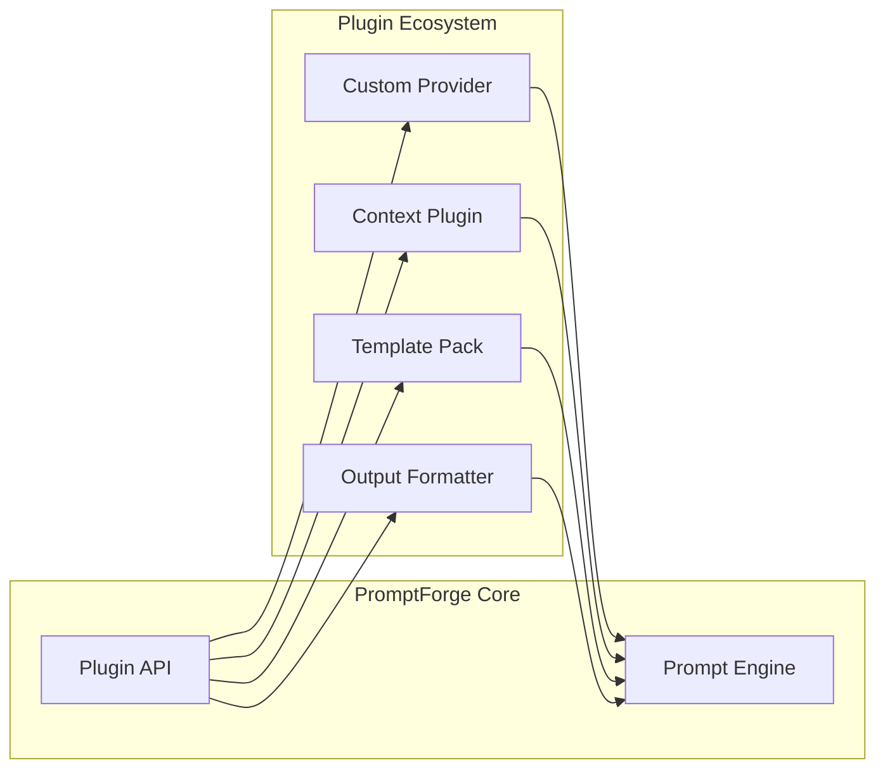

# PromptForge AI — System Architecture

## 1. Overview

PromptForge AI is a **local-first Electron desktop application** that enhances AI prompts via global hotkeys. The architecture follows three core principles:

- **Modular** — Each concern (hotkeys, clipboard, AI providers, templates) lives in its own isolated module with well-defined interfaces. Modules communicate through typed events and IPC channels, never through shared mutable state.
- **Event-Driven** — The entire flow is triggered by user events (hotkeys, tray clicks, command palette actions). The main process acts as an event bus, coordinating between the OS layer, renderer processes, and service layer without blocking.
- **Local-First** — All data (history, templates, configuration) is stored locally in SQLite. AI provider API keys are encrypted via the OS keychain. No telemetry, no cloud sync, no external dependencies beyond the AI providers the user explicitly configures.

---

## 2. High-Level Architecture Diagram



---

## 3. Layer Descriptions

### Presentation Layer

The UI layer rendered in Electron's BrowserWindow contexts using React + Tailwind CSS.

| Component | Purpose |
|-----------|---------|
| **Settings Window** | Full configuration UI — provider keys, hotkey bindings, template management, appearance |
| **Command Palette** | Quick-access overlay (Cmd/Ctrl+Shift+P) for searching templates, history, and actions |
| **Floating Popup** | Minimal, always-on-top window showing streaming AI responses and quick actions |
| **Toast Notifications** | Non-intrusive feedback for completed operations, errors, and status updates |

### Electron Main Process

The OS-level coordinator that bridges hardware events with application logic.

| Module | Responsibility |
|--------|---------------|
| **Global Hotkey Manager** | Registers and listens for system-wide keyboard shortcuts via `globalShortcut` API |
| **Clipboard Manager** | Reads/writes system clipboard, handles rich text and plain text formats |
| **System Tray** | Persistent tray icon with context menu for quick access and status indication |
| **IPC Bridge** | Type-safe bidirectional communication between main and renderer processes |
| **Window Manager** | Creates, positions, and manages BrowserWindow lifecycle (show/hide/focus) |

### Service Layer

Business logic that is process-agnostic — can run in main process or be extracted to a worker.

| Service | Responsibility |
|---------|---------------|
| **Prompt Engine** | Orchestrates the full enhancement pipeline: context → template → provider → response |
| **Context Detector** | Analyzes clipboard content to determine type (code, prose, email, chat) and language |
| **Template Engine** | Compiles Handlebars/Mustache templates with context variables, supports custom user templates |
| **History Manager** | Persists all prompt/response pairs with metadata for search and replay |

### AI Provider Layer

Adapter pattern — each provider implements a common `AIProvider` interface.

| Provider | Type | Use Case |
|----------|------|----------|
| **Ollama** | Local | Privacy-first, offline operation, no API key needed |
| **Groq** | Cloud | Ultra-fast inference for real-time enhancement |
| **OpenAI** | Cloud | GPT-4o/o1 for complex reasoning tasks |
| **Gemini** | Cloud | Google models, multimodal support |
| **OpenRouter** | Cloud | Access to 100+ models through single API key |

### Data Layer

| Store | Technology | Purpose |
|-------|-----------|---------|
| **SQLite DB** | better-sqlite3 | Prompt history, templates, usage analytics |
| **Config Store** | electron-store | App settings, window positions, feature flags |

### Integration Layer

| Interface | Purpose |
|-----------|---------|
| **Fastify HTTP API** | Local REST API (localhost:9721) for external tool integration, Alfred/Raycast workflows |
| **MCP Server** | (Future) Model Context Protocol server for AI agent integration |

---

## 4. Core Data Flow



---

## 5. IPC Communication



### IPC Channel Registry

| Channel | Direction | Payload | Purpose |
|---------|-----------|---------|---------|
| `prompt:enhance` | Renderer → Main | `{ text, options }` | Trigger prompt enhancement |
| `prompt:result` | Main → Renderer | `{ result, metadata }` | Return enhanced prompt |
| `stream:chunk` | Main → Renderer | `{ chunk, done }` | Stream partial responses |
| `config:get` | Renderer → Main | `{ key }` | Read configuration value |
| `config:set` | Renderer → Main | `{ key, value }` | Update configuration |
| `history:query` | Renderer → Main | `{ filters, pagination }` | Query prompt history |
| `template:list` | Renderer → Main | `{ category? }` | List available templates |
| `provider:test` | Renderer → Main | `{ provider, apiKey }` | Test provider connection |
| `hotkey:register` | Renderer → Main | `{ combo, action }` | Register new hotkey |
| `window:toggle` | Main → Renderer | `{ window, visible }` | Window visibility change |

---

## 6. Directory Structure

```
promptforge-ai/
├── src/
│   ├── main/                   # Electron main process
│   │   ├── hotkeys/            # Global hotkey registration & management
│   │   │   ├── manager.ts      # Hotkey lifecycle (register/unregister)
│   │   │   └── defaults.ts     # Default hotkey bindings
│   │   ├── clipboard/          # System clipboard operations
│   │   │   ├── reader.ts       # Read clipboard (text, rich text, image)
│   │   │   └── writer.ts       # Write to clipboard + auto-paste
│   │   ├── tray/               # System tray icon & menu
│   │   │   └── tray.ts         # Tray setup and context menu
│   │   ├── ipc/                # IPC channel handlers
│   │   │   ├── handlers.ts     # All ipcMain.handle registrations
│   │   │   └── channels.ts     # Type-safe channel definitions
│   │   ├── windows/            # Window creation & management
│   │   │   ├── settings.ts     # Settings window factory
│   │   │   ├── popup.ts        # Floating popup window
│   │   │   └── palette.ts      # Command palette overlay
│   │   └── index.ts            # Main entry point, app lifecycle
│   │
│   ├── renderer/               # React frontend (Vite bundled)
│   │   ├── components/         # Reusable UI components
│   │   │   ├── ui/             # Base components (Button, Input, Card)
│   │   │   ├── prompt/         # Prompt-specific components
│   │   │   └── provider/       # Provider config components
│   │   ├── pages/              # Full page views
│   │   │   ├── Settings.tsx    # Settings page
│   │   │   ├── History.tsx     # Prompt history browser
│   │   │   └── Templates.tsx   # Template manager
│   │   ├── hooks/              # Custom React hooks
│   │   │   ├── useIPC.ts       # Type-safe IPC communication
│   │   │   └── useStream.ts    # Streaming response handler
│   │   ├── stores/             # Zustand state stores
│   │   │   ├── appStore.ts     # Global app state
│   │   │   └── promptStore.ts  # Active prompt state
│   │   └── App.tsx             # Root component + router
│   │
│   ├── services/               # Shared business logic
│   │   ├── ai/                 # AI provider adapters
│   │   │   ├── provider.ts     # AIProvider interface
│   │   │   ├── ollama.ts       # Ollama adapter
│   │   │   ├── groq.ts         # Groq adapter
│   │   │   ├── openai.ts       # OpenAI adapter
│   │   │   ├── gemini.ts       # Gemini adapter
│   │   │   ├── openrouter.ts   # OpenRouter adapter
│   │   │   └── router.ts       # Provider selection logic
│   │   ├── prompt/             # Prompt processing engine
│   │   │   ├── engine.ts       # Main orchestrator
│   │   │   └── enhancer.ts     # Prompt enhancement strategies
│   │   ├── context/            # Context detection
│   │   │   ├── detector.ts     # Content type analysis
│   │   │   └── patterns.ts     # Detection patterns & heuristics
│   │   ├── template/           # Template engine
│   │   │   ├── compiler.ts     # Template compilation & caching
│   │   │   └── loader.ts       # Template file loader
│   │   └── db/                 # Database layer
│   │       ├── database.ts     # SQLite connection & setup
│   │       ├── history.ts      # History CRUD operations
│   │       └── templates.ts    # Template CRUD operations
│   │
│   ├── server/                 # Local HTTP API (Fastify)
│   │   ├── index.ts            # Server bootstrap
│   │   ├── routes/             # API route definitions
│   │   └── auth.ts             # Bearer token middleware
│   │
│   └── shared/                 # Shared types and utilities
│       ├── types.ts            # TypeScript interfaces & types
│       ├── constants.ts        # App-wide constants
│       └── utils.ts            # Shared utility functions
│
├── resources/                  # Static assets
│   ├── icons/                  # App icons (all sizes)
│   └── sounds/                 # Notification sounds (optional)
│
├── templates/                  # Built-in prompt templates
│   ├── enhance/                # General enhancement templates
│   ├── code/                   # Code-specific templates
│   ├── writing/                # Writing & prose templates
│   └── custom/                 # User-created templates
│
├── migrations/                 # SQLite schema migrations
│   ├── 001_initial.sql         # History, templates tables
│   └── 002_analytics.sql       # Usage tracking tables
│
├── tests/                      # Test suite
│   ├── unit/                   # Unit tests (Vitest)
│   ├── integration/            # Integration tests
│   └── e2e/                    # End-to-end tests (Playwright)
│
├── electron-builder.yml        # Electron build configuration
├── vite.config.ts              # Vite bundler config
├── tsconfig.json               # TypeScript configuration
├── package.json                # Dependencies & scripts
└── README.md                   # Project documentation
```

---

## 7. Security Model

PromptForge AI is designed with a **zero-trust, local-first** security posture.

### Principles

| Principle | Implementation |
|-----------|---------------|
| **No Telemetry** | Zero outbound requests except to user-configured AI providers. No analytics, no crash reporting, no update checks without consent. |
| **API Key Encryption** | All provider API keys stored via OS keychain (`keytar`): Windows Credential Vault, macOS Keychain, Linux Secret Service. Never written to disk in plaintext. |
| **Minimal Clipboard Access** | Clipboard is read **only** on explicit hotkey trigger, never polled or monitored in background. Read → process → write is atomic. |
| **Local HTTP API Auth** | The Fastify server binds to `127.0.0.1` only. All requests require a bearer token generated on first launch and stored in OS keychain. |
| **Process Isolation** | Renderer processes run with `contextIsolation: true`, `nodeIntegration: false`. All Node.js access goes through the preload script's typed IPC bridge. |
| **No Remote Code** | No `eval()`, no remote module loading, CSP headers enforced in all windows. |

### Threat Model

| Threat | Mitigation |
|--------|-----------|
| Clipboard sniffing by malware | Clipboard access is momentary; data is not cached beyond the active operation |
| API key extraction from memory | Keys loaded from keychain on-demand, zeroed after use in provider calls |
| Local HTTP API abuse | Bound to localhost + bearer token + optional allowlist of calling processes |
| Supply chain attack | Pinned dependencies, lockfile integrity checks, Electron's built-in sandboxing |

---

## 8. Performance Considerations

### Streaming Responses

AI responses stream token-by-token to the floating popup via IPC. The user sees output immediately rather than waiting for full completion. Backpressure is handled by buffering chunks in 50ms batches before IPC transmission.

### Lazy Loading

- Settings window and history browser are created on-demand, not at startup
- Template files loaded only when their category is accessed
- Provider adapters instantiated only when first used

### Connection Pooling

Each AI provider adapter maintains a persistent HTTP agent with keep-alive connections. Connection pool size is configurable per provider (default: 4 concurrent connections for cloud, unlimited for local Ollama).

### Template Compilation Caching

Handlebars templates are compiled once and cached in an LRU cache (max 100 entries). Cache invalidation occurs only on template file modification (watched via `fs.watch`).

### Memory Footprint

| State | Target Memory |
|-------|--------------|
| Idle (tray only) | < 50 MB |
| Active (popup open) | < 120 MB |
| Settings window open | < 180 MB |

Achieved through:
- Deferred window creation
- Aggressive garbage collection hints after large responses
- SQLite WAL mode for non-blocking reads
- History pagination (never load full dataset into memory)

### Startup Time

Target: **< 800ms** from launch to hotkey-ready.

- Preload only: hotkey registration, tray creation, clipboard module
- Defer: provider health checks, template indexing, HTTP server boot

---

## 9. Scalability

### Plugin Architecture (v2 Roadmap)



Plugins will be sandboxed Node.js modules that implement defined interfaces:
- `ProviderPlugin` — Add new AI providers
- `ContextPlugin` — Add new content detection strategies
- `TemplatePlugin` — Bundle template packs
- `FormatterPlugin` — Custom output post-processing

### Provider Adapter Pattern

All AI providers implement a common interface:

```typescript
interface AIProvider {
  id: string;
  name: string;
  isAvailable(): Promise<boolean>;
  complete(prompt: string, options: CompletionOptions): AsyncIterable<string>;
  models(): Promise<Model[]>;
}
```

Adding a new provider requires only implementing this interface and registering it with the provider router. Zero changes to the prompt engine or UI.

### Template Hot-Reload

Templates in the `templates/` directory are watched for changes. On modification:
1. File watcher detects change
2. Template is recompiled and cache entry is invalidated
3. Next prompt enhancement uses the updated template
4. No app restart required

Users can add templates by dropping `.hbs` files into the templates directory or through the Settings UI.

---

## Technology Stack Summary

| Layer | Technology |
|-------|-----------|
| Runtime | Electron 33+ (Chromium + Node.js) |
| Frontend | React 19, Tailwind CSS 4, Zustand |
| Bundler | Vite 6 (renderer), esbuild (main) |
| Database | SQLite via better-sqlite3 |
| HTTP Server | Fastify 5 |
| AI SDKs | Vercel AI SDK (unified streaming interface) |
| Testing | Vitest (unit), Playwright (e2e) |
| Build | electron-builder (cross-platform packaging) |
| Language | TypeScript 5.x (strict mode) throughout |
