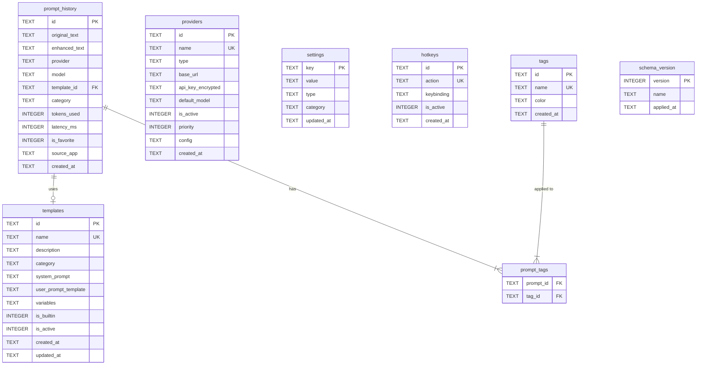

# Database Schema

## Overview

| Property | Value |
|----------|-------|
| **Engine** | SQLite 3 via [`better-sqlite3`](https://github.com/WiseLibs/better-sqlite3) |
| **Location** | `{userData}/promptforge.db` |
| **Encryption** | API keys encrypted with `electron-safeStorage` (OS keychain) |
| **Migrations** | Versioned SQL files in `/migrations` directory |
| **Foreign Keys** | Enabled via `PRAGMA foreign_keys = ON` |
| **WAL Mode** | Enabled via `PRAGMA journal_mode = WAL` for concurrent reads |

---

## Entity Relationship Diagram



---

## Tables

### `prompt_history`

Stores every prompt enhancement with before/after text, performance metrics, and metadata.

```sql
CREATE TABLE prompt_history (
  id TEXT PRIMARY KEY DEFAULT (lower(hex(randomblob(16)))),
  original_text TEXT NOT NULL,
  enhanced_text TEXT NOT NULL,
  provider TEXT NOT NULL,
  model TEXT NOT NULL,
  template_id TEXT REFERENCES templates(id) ON DELETE SET NULL,
  category TEXT DEFAULT 'general',
  tokens_used INTEGER DEFAULT 0,
  latency_ms INTEGER DEFAULT 0,
  is_favorite INTEGER DEFAULT 0,
  source_app TEXT,
  created_at TEXT DEFAULT (datetime('now'))
);
```

| Column | Type | Description |
|--------|------|-------------|
| `id` | TEXT | 32-char hex UUID |
| `original_text` | TEXT | The user's original prompt before enhancement |
| `enhanced_text` | TEXT | The AI-enhanced result |
| `provider` | TEXT | Provider name used (e.g., `ollama`, `groq`) |
| `model` | TEXT | Specific model used (e.g., `llama3.1`, `gpt-4o`) |
| `template_id` | TEXT | Reference to the template used, if any |
| `category` | TEXT | Classification: `general`, `code`, `writing`, `creative` |
| `tokens_used` | INTEGER | Total tokens consumed (input + output) |
| `latency_ms` | INTEGER | Round-trip time in milliseconds |
| `is_favorite` | INTEGER | Boolean flag (0/1) for starred prompts |
| `source_app` | TEXT | Detected source application (e.g., `VS Code`, `Chrome`) |
| `created_at` | TEXT | ISO 8601 timestamp |

---

### `templates`

Reusable prompt templates with system instructions and variable placeholders.

```sql
CREATE TABLE templates (
  id TEXT PRIMARY KEY DEFAULT (lower(hex(randomblob(16)))),
  name TEXT NOT NULL UNIQUE,
  description TEXT,
  category TEXT NOT NULL,
  system_prompt TEXT NOT NULL,
  user_prompt_template TEXT NOT NULL,
  variables TEXT DEFAULT '[]',
  is_builtin INTEGER DEFAULT 0,
  is_active INTEGER DEFAULT 1,
  created_at TEXT DEFAULT (datetime('now')),
  updated_at TEXT DEFAULT (datetime('now'))
);
```

| Column | Type | Description |
|--------|------|-------------|
| `id` | TEXT | 32-char hex UUID |
| `name` | TEXT | Unique display name |
| `description` | TEXT | Brief explanation of what this template does |
| `category` | TEXT | Grouping: `enhancement`, `expansion`, `compression`, `custom` |
| `system_prompt` | TEXT | System-level instructions for the AI |
| `user_prompt_template` | TEXT | Template with `{{variable}}` placeholders |
| `variables` | TEXT | JSON array of variable definitions |
| `is_builtin` | INTEGER | Whether this ships with the app (0/1) |
| `is_active` | INTEGER | Soft-delete flag (0/1) |
| `created_at` | TEXT | ISO 8601 timestamp |
| `updated_at` | TEXT | ISO 8601 timestamp, updated on modification |

**Variables JSON format:**

```json
[
  { "name": "tone", "type": "select", "options": ["professional", "casual", "academic"], "default": "professional" },
  { "name": "context", "type": "text", "default": "" }
]
```

---

### `providers`

AI provider configurations with encrypted credentials.

```sql
CREATE TABLE providers (
  id TEXT PRIMARY KEY DEFAULT (lower(hex(randomblob(16)))),
  name TEXT NOT NULL UNIQUE,
  type TEXT NOT NULL CHECK (type IN ('local', 'cloud')),
  base_url TEXT NOT NULL,
  api_key_encrypted TEXT,
  default_model TEXT NOT NULL,
  is_active INTEGER DEFAULT 1,
  priority INTEGER DEFAULT 0,
  config TEXT DEFAULT '{}',
  created_at TEXT DEFAULT (datetime('now'))
);
```

| Column | Type | Description |
|--------|------|-------------|
| `id` | TEXT | 32-char hex UUID |
| `name` | TEXT | Unique provider name (`ollama`, `groq`, `openai`, etc.) |
| `type` | TEXT | `local` (Ollama) or `cloud` (API-based) |
| `base_url` | TEXT | API endpoint URL |
| `api_key_encrypted` | TEXT | Base64-encoded encrypted API key (null for local) |
| `default_model` | TEXT | Default model identifier |
| `is_active` | INTEGER | Whether this provider is enabled (0/1) |
| `priority` | INTEGER | Failover order (higher = preferred) |
| `config` | TEXT | JSON object for provider-specific settings |
| `created_at` | TEXT | ISO 8601 timestamp |

**Config JSON format:**

```json
{
  "temperature": 0.7,
  "max_tokens": 2048,
  "timeout_ms": 30000,
  "retry_count": 2
}
```

---

### `settings`

Key-value store for application preferences.

```sql
CREATE TABLE settings (
  key TEXT PRIMARY KEY,
  value TEXT NOT NULL,
  type TEXT NOT NULL CHECK (type IN ('string', 'number', 'boolean', 'json')),
  category TEXT NOT NULL DEFAULT 'general',
  updated_at TEXT DEFAULT (datetime('now'))
);
```

| Column | Type | Description |
|--------|------|-------------|
| `key` | TEXT | Unique setting identifier (e.g., `theme`, `data_retention_days`) |
| `value` | TEXT | Serialized value (all types stored as text) |
| `type` | TEXT | Value type for deserialization |
| `category` | TEXT | Grouping: `general`, `appearance`, `privacy`, `advanced` |
| `updated_at` | TEXT | Last modification timestamp |

**Default settings:**

| Key | Value | Type | Category |
|-----|-------|------|----------|
| `theme` | `system` | string | appearance |
| `data_retention_days` | `-1` | number | privacy |
| `startup_minimize` | `true` | boolean | general |
| `clipboard_auto_paste` | `true` | boolean | general |
| `analytics_enabled` | `false` | boolean | privacy |

---

### `hotkeys`

Global keyboard shortcut bindings.

```sql
CREATE TABLE hotkeys (
  id TEXT PRIMARY KEY DEFAULT (lower(hex(randomblob(16)))),
  action TEXT NOT NULL UNIQUE,
  keybinding TEXT NOT NULL,
  is_active INTEGER DEFAULT 1,
  created_at TEXT DEFAULT (datetime('now'))
);
```

| Column | Type | Description |
|--------|------|-------------|
| `id` | TEXT | 32-char hex UUID |
| `action` | TEXT | Action identifier (e.g., `enhance`, `expand`, `palette`) |
| `keybinding` | TEXT | Electron accelerator format (e.g., `Ctrl+Shift+E`) |
| `is_active` | INTEGER | Whether this hotkey is registered (0/1) |
| `created_at` | TEXT | ISO 8601 timestamp |

---

### `tags`

User-defined tags for organizing prompt history.

```sql
CREATE TABLE tags (
  id TEXT PRIMARY KEY DEFAULT (lower(hex(randomblob(16)))),
  name TEXT NOT NULL UNIQUE,
  color TEXT DEFAULT '#3B82F6',
  created_at TEXT DEFAULT (datetime('now'))
);
```

| Column | Type | Description |
|--------|------|-------------|
| `id` | TEXT | 32-char hex UUID |
| `name` | TEXT | Unique tag name |
| `color` | TEXT | Hex color code for UI display |
| `created_at` | TEXT | ISO 8601 timestamp |

---

### `prompt_tags` (Junction Table)

Many-to-many relationship between prompts and tags.

```sql
CREATE TABLE prompt_tags (
  prompt_id TEXT NOT NULL REFERENCES prompt_history(id) ON DELETE CASCADE,
  tag_id TEXT NOT NULL REFERENCES tags(id) ON DELETE CASCADE,
  PRIMARY KEY (prompt_id, tag_id)
);
```

---

### `schema_version`

Tracks applied migrations.

```sql
CREATE TABLE schema_version (
  version INTEGER PRIMARY KEY,
  name TEXT NOT NULL,
  applied_at TEXT DEFAULT (datetime('now'))
);
```

---

## Indexes

```sql
-- prompt_history indexes
CREATE INDEX idx_prompt_history_created_at ON prompt_history(created_at DESC);
CREATE INDEX idx_prompt_history_category ON prompt_history(category);
CREATE INDEX idx_prompt_history_provider ON prompt_history(provider);
CREATE INDEX idx_prompt_history_is_favorite ON prompt_history(is_favorite) WHERE is_favorite = 1;
CREATE INDEX idx_prompt_history_template_id ON prompt_history(template_id);

-- templates indexes
CREATE INDEX idx_templates_category ON templates(category);
CREATE INDEX idx_templates_is_active ON templates(is_active) WHERE is_active = 1;

-- providers indexes
CREATE INDEX idx_providers_is_active ON providers(is_active) WHERE is_active = 1;
CREATE INDEX idx_providers_priority ON providers(priority DESC);

-- tags index
CREATE INDEX idx_tags_name ON tags(name);

-- prompt_tags indexes (for reverse lookups)
CREATE INDEX idx_prompt_tags_tag_id ON prompt_tags(tag_id);
```

### Full-Text Search (FTS5)

A virtual table enables fast full-text search across prompt content:

```sql
CREATE VIRTUAL TABLE prompt_history_fts USING fts5(
  original_text,
  enhanced_text,
  content='prompt_history',
  content_rowid='rowid'
);

-- Triggers to keep FTS index synchronized
CREATE TRIGGER prompt_history_ai AFTER INSERT ON prompt_history BEGIN
  INSERT INTO prompt_history_fts(rowid, original_text, enhanced_text)
  VALUES (new.rowid, new.original_text, new.enhanced_text);
END;

CREATE TRIGGER prompt_history_ad AFTER DELETE ON prompt_history BEGIN
  INSERT INTO prompt_history_fts(prompt_history_fts, rowid, original_text, enhanced_text)
  VALUES ('delete', old.rowid, old.original_text, old.enhanced_text);
END;

CREATE TRIGGER prompt_history_au AFTER UPDATE ON prompt_history BEGIN
  INSERT INTO prompt_history_fts(prompt_history_fts, rowid, original_text, enhanced_text)
  VALUES ('delete', old.rowid, old.original_text, old.enhanced_text);
  INSERT INTO prompt_history_fts(rowid, original_text, enhanced_text)
  VALUES (new.rowid, new.original_text, new.enhanced_text);
END;
```

---

## Migration Strategy

### File Naming Convention

```
migrations/
├── 001_initial.sql
├── 002_add_fts.sql
├── 003_add_tags.sql
└── 004_add_hotkeys.sql
```

### Migration Runner

Migrations execute sequentially on app startup. Each migration is wrapped in a transaction:

```typescript
import Database from 'better-sqlite3';
import fs from 'fs';
import path from 'path';

function runMigrations(db: Database.Database): void {
  db.pragma('foreign_keys = ON');
  db.pragma('journal_mode = WAL');

  // Ensure schema_version table exists
  db.exec(`
    CREATE TABLE IF NOT EXISTS schema_version (
      version INTEGER PRIMARY KEY,
      name TEXT NOT NULL,
      applied_at TEXT DEFAULT (datetime('now'))
    );
  `);

  const currentVersion = db.prepare(
    'SELECT COALESCE(MAX(version), 0) as version FROM schema_version'
  ).get() as { version: number };

  const migrationsDir = path.join(__dirname, '../migrations');
  const files = fs.readdirSync(migrationsDir)
    .filter(f => f.endsWith('.sql'))
    .sort();

  for (const file of files) {
    const version = parseInt(file.split('_')[0], 10);
    if (version <= currentVersion.version) continue;

    const sql = fs.readFileSync(path.join(migrationsDir, file), 'utf-8');
    const migrate = db.transaction(() => {
      db.exec(sql);
      db.prepare('INSERT INTO schema_version (version, name) VALUES (?, ?)').run(version, file);
    });
    migrate();
    console.log(`[DB] Applied migration: ${file}`);
  }
}
```

### Example Migration: `001_initial.sql`

```sql
-- 001_initial.sql
-- Initial schema for PromptForge AI

CREATE TABLE templates (
  id TEXT PRIMARY KEY DEFAULT (lower(hex(randomblob(16)))),
  name TEXT NOT NULL UNIQUE,
  description TEXT,
  category TEXT NOT NULL,
  system_prompt TEXT NOT NULL,
  user_prompt_template TEXT NOT NULL,
  variables TEXT DEFAULT '[]',
  is_builtin INTEGER DEFAULT 0,
  is_active INTEGER DEFAULT 1,
  created_at TEXT DEFAULT (datetime('now')),
  updated_at TEXT DEFAULT (datetime('now'))
);

CREATE TABLE providers (
  id TEXT PRIMARY KEY DEFAULT (lower(hex(randomblob(16)))),
  name TEXT NOT NULL UNIQUE,
  type TEXT NOT NULL CHECK (type IN ('local', 'cloud')),
  base_url TEXT NOT NULL,
  api_key_encrypted TEXT,
  default_model TEXT NOT NULL,
  is_active INTEGER DEFAULT 1,
  priority INTEGER DEFAULT 0,
  config TEXT DEFAULT '{}',
  created_at TEXT DEFAULT (datetime('now'))
);

CREATE TABLE prompt_history (
  id TEXT PRIMARY KEY DEFAULT (lower(hex(randomblob(16)))),
  original_text TEXT NOT NULL,
  enhanced_text TEXT NOT NULL,
  provider TEXT NOT NULL,
  model TEXT NOT NULL,
  template_id TEXT REFERENCES templates(id) ON DELETE SET NULL,
  category TEXT DEFAULT 'general',
  tokens_used INTEGER DEFAULT 0,
  latency_ms INTEGER DEFAULT 0,
  is_favorite INTEGER DEFAULT 0,
  source_app TEXT,
  created_at TEXT DEFAULT (datetime('now'))
);

CREATE TABLE settings (
  key TEXT PRIMARY KEY,
  value TEXT NOT NULL,
  type TEXT NOT NULL CHECK (type IN ('string', 'number', 'boolean', 'json')),
  category TEXT NOT NULL DEFAULT 'general',
  updated_at TEXT DEFAULT (datetime('now'))
);

CREATE TABLE hotkeys (
  id TEXT PRIMARY KEY DEFAULT (lower(hex(randomblob(16)))),
  action TEXT NOT NULL UNIQUE,
  keybinding TEXT NOT NULL,
  is_active INTEGER DEFAULT 1,
  created_at TEXT DEFAULT (datetime('now'))
);

CREATE TABLE tags (
  id TEXT PRIMARY KEY DEFAULT (lower(hex(randomblob(16)))),
  name TEXT NOT NULL UNIQUE,
  color TEXT DEFAULT '#3B82F6',
  created_at TEXT DEFAULT (datetime('now'))
);

CREATE TABLE prompt_tags (
  prompt_id TEXT NOT NULL REFERENCES prompt_history(id) ON DELETE CASCADE,
  tag_id TEXT NOT NULL REFERENCES tags(id) ON DELETE CASCADE,
  PRIMARY KEY (prompt_id, tag_id)
);

-- Indexes
CREATE INDEX idx_prompt_history_created_at ON prompt_history(created_at DESC);
CREATE INDEX idx_prompt_history_category ON prompt_history(category);
CREATE INDEX idx_prompt_history_provider ON prompt_history(provider);
CREATE INDEX idx_prompt_history_is_favorite ON prompt_history(is_favorite) WHERE is_favorite = 1;
CREATE INDEX idx_prompt_history_template_id ON prompt_history(template_id);
CREATE INDEX idx_templates_category ON templates(category);
CREATE INDEX idx_templates_is_active ON templates(is_active) WHERE is_active = 1;
CREATE INDEX idx_providers_is_active ON providers(is_active) WHERE is_active = 1;
CREATE INDEX idx_providers_priority ON providers(priority DESC);
CREATE INDEX idx_tags_name ON tags(name);
CREATE INDEX idx_prompt_tags_tag_id ON prompt_tags(tag_id);

-- Default settings
INSERT INTO settings (key, value, type, category) VALUES
  ('theme', 'system', 'string', 'appearance'),
  ('data_retention_days', '-1', 'number', 'privacy'),
  ('startup_minimize', 'true', 'boolean', 'general'),
  ('clipboard_auto_paste', 'true', 'boolean', 'general'),
  ('analytics_enabled', 'false', 'boolean', 'privacy');

-- Default hotkeys
INSERT INTO hotkeys (id, action, keybinding) VALUES
  (lower(hex(randomblob(16))), 'enhance', 'Ctrl+Shift+E'),
  (lower(hex(randomblob(16))), 'expand', 'Ctrl+Shift+X'),
  (lower(hex(randomblob(16))), 'compress', 'Ctrl+Shift+C'),
  (lower(hex(randomblob(16))), 'palette', 'Ctrl+Shift+P'),
  (lower(hex(randomblob(16))), 'templates', 'Ctrl+Shift+T'),
  (lower(hex(randomblob(16))), 'history', 'Ctrl+Shift+H');

-- Default providers
INSERT INTO providers (id, name, type, base_url, default_model, is_active, priority) VALUES
  (lower(hex(randomblob(16))), 'ollama', 'local', 'http://localhost:11434', 'llama3.1', 1, 100);
```

---

## Encryption

### How API Keys Are Stored

```
┌──────────────────────────────────────────────────────┐
│                  Write Path                            │
│                                                       │
│  User Input ──► safeStorage.encryptString() ──► DB   │
│  "sk-abc..."    (OS Keychain encryption)      base64 │
└──────────────────────────────────────────────────────┘

┌──────────────────────────────────────────────────────┐
│                  Read Path                             │
│                                                       │
│  DB (base64) ──► safeStorage.decryptString() ──► Use │
│                  (OS Keychain decryption)             │
└──────────────────────────────────────────────────────┘
```

### Implementation

```typescript
import { safeStorage } from 'electron';

function encryptApiKey(plaintext: string): string {
  const encrypted = safeStorage.encryptString(plaintext);
  return encrypted.toString('base64');
}

function decryptApiKey(base64Cipher: string): string {
  const buffer = Buffer.from(base64Cipher, 'base64');
  return safeStorage.decryptString(buffer);
}
```

### Security Guarantees

- Keys encrypted using the **OS credential store** (Windows DPAPI, macOS Keychain, Linux Secret Service)
- Encryption is tied to the current OS user session
- Database file alone cannot expose API keys
- Keys are decrypted in-memory only when making API calls

---

## Data Retention

### Configuration

Data retention is controlled by the `data_retention_days` setting:

| Value | Retention Period |
|-------|-----------------|
| `-1` | Forever (default) |
| `7` | 7 days |
| `30` | 30 days |
| `90` | 90 days |
| `365` | 1 year |

### Cleanup Implementation

Runs automatically on app startup:

```typescript
function cleanupOldHistory(db: Database.Database): number {
  const retention = db.prepare(
    "SELECT value FROM settings WHERE key = 'data_retention_days'"
  ).get() as { value: string } | undefined;

  const days = parseInt(retention?.value ?? '-1', 10);
  if (days <= 0) return 0; // Keep forever

  const result = db.prepare(`
    DELETE FROM prompt_history
    WHERE created_at < datetime('now', ? || ' days')
  `).run(`-${days}`);

  return result.changes;
}
```

---

## Example Queries

### 1. Recent History (Paginated)

```sql
SELECT
  ph.id,
  ph.original_text,
  ph.enhanced_text,
  ph.provider,
  ph.model,
  ph.latency_ms,
  ph.source_app,
  ph.created_at,
  t.name AS template_name
FROM prompt_history ph
LEFT JOIN templates t ON ph.template_id = t.id
ORDER BY ph.created_at DESC
LIMIT 20 OFFSET 0;
```

### 2. Full-Text Search

```sql
SELECT
  ph.id,
  ph.original_text,
  ph.enhanced_text,
  ph.provider,
  ph.created_at,
  rank
FROM prompt_history_fts
JOIN prompt_history ph ON prompt_history_fts.rowid = ph.rowid
WHERE prompt_history_fts MATCH 'refactor AND typescript'
ORDER BY rank
LIMIT 10;
```

### 3. Favorite Prompts

```sql
SELECT
  ph.id,
  ph.original_text,
  ph.enhanced_text,
  ph.provider,
  ph.model,
  ph.created_at,
  GROUP_CONCAT(tg.name, ', ') AS tags
FROM prompt_history ph
LEFT JOIN prompt_tags pt ON ph.id = pt.prompt_id
LEFT JOIN tags tg ON pt.tag_id = tg.id
WHERE ph.is_favorite = 1
GROUP BY ph.id
ORDER BY ph.created_at DESC;
```

### 4. Usage Statistics by Provider

```sql
SELECT
  provider,
  model,
  COUNT(*) AS total_uses,
  SUM(tokens_used) AS total_tokens,
  ROUND(AVG(latency_ms)) AS avg_latency_ms,
  MIN(created_at) AS first_used,
  MAX(created_at) AS last_used
FROM prompt_history
GROUP BY provider, model
ORDER BY total_uses DESC;
```

### 5. Template Usage Count

```sql
SELECT
  t.id,
  t.name,
  t.category,
  COUNT(ph.id) AS usage_count,
  MAX(ph.created_at) AS last_used
FROM templates t
LEFT JOIN prompt_history ph ON t.id = ph.template_id
WHERE t.is_active = 1
GROUP BY t.id
ORDER BY usage_count DESC;
```

### 6. Daily Enhancement Activity (Last 30 Days)

```sql
SELECT
  date(created_at) AS day,
  COUNT(*) AS enhancements,
  SUM(tokens_used) AS tokens,
  ROUND(AVG(latency_ms)) AS avg_latency
FROM prompt_history
WHERE created_at >= datetime('now', '-30 days')
GROUP BY date(created_at)
ORDER BY day DESC;
```

---

## Database Initialization

Complete initialization sequence on first launch:

```typescript
import Database from 'better-sqlite3';
import { app } from 'electron';
import path from 'path';

function initDatabase(): Database.Database {
  const dbPath = path.join(app.getPath('userData'), 'promptforge.db');
  const db = new Database(dbPath);

  // Performance and safety pragmas
  db.pragma('journal_mode = WAL');
  db.pragma('foreign_keys = ON');
  db.pragma('busy_timeout = 5000');
  db.pragma('synchronous = NORMAL');
  db.pragma('cache_size = -64000'); // 64MB cache

  // Run migrations
  runMigrations(db);

  // Cleanup old data based on retention policy
  cleanupOldHistory(db);

  return db;
}
```

---

## Backup & Export

The database supports manual backup via file copy (WAL mode checkpoint first):

```typescript
function backupDatabase(db: Database.Database, destPath: string): void {
  db.pragma('wal_checkpoint(TRUNCATE)');
  db.backup(destPath);
}
```

Export formats supported:
- **JSON** — Full history export for portability
- **CSV** — Prompt history for spreadsheet analysis
- **SQLite** — Raw database file copy
