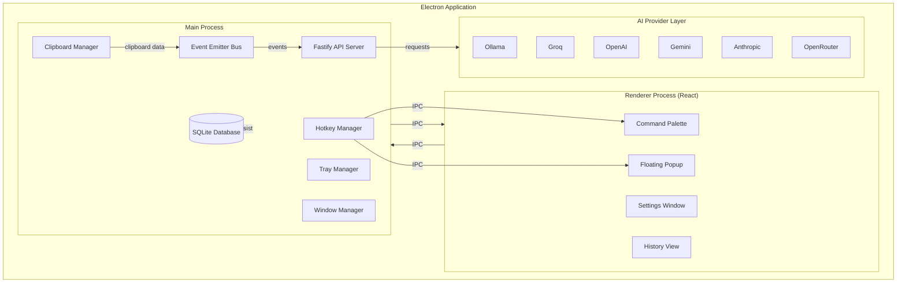
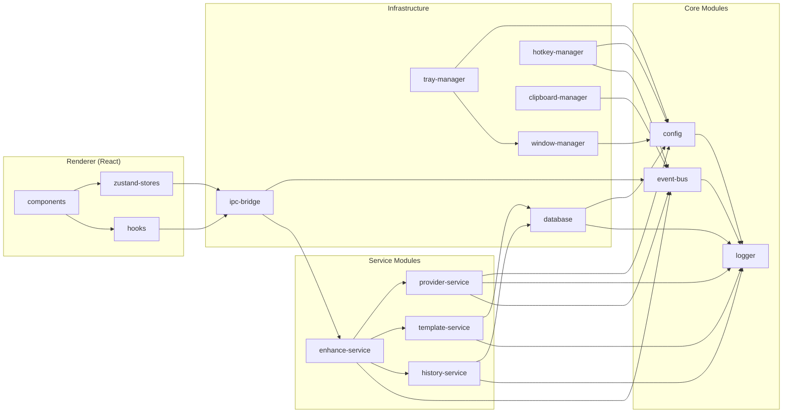
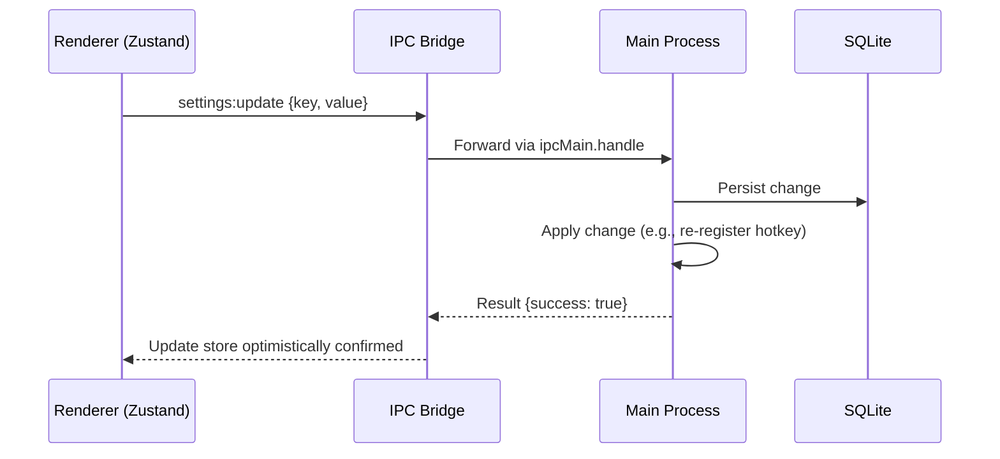
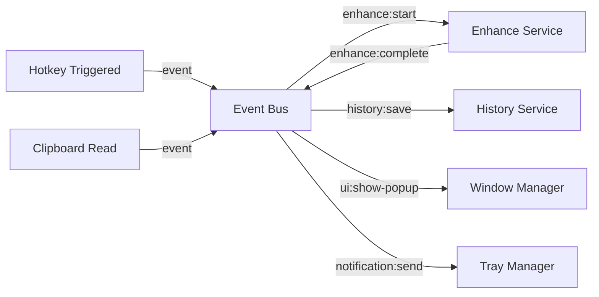
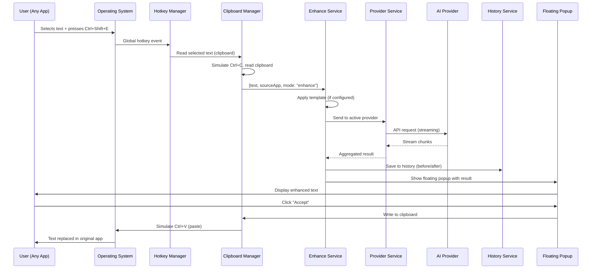
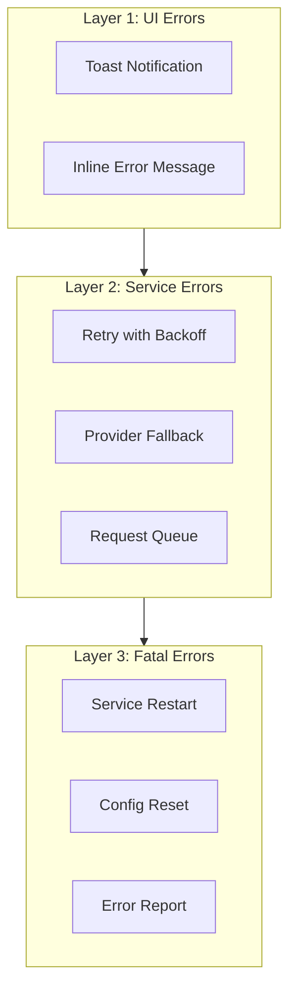
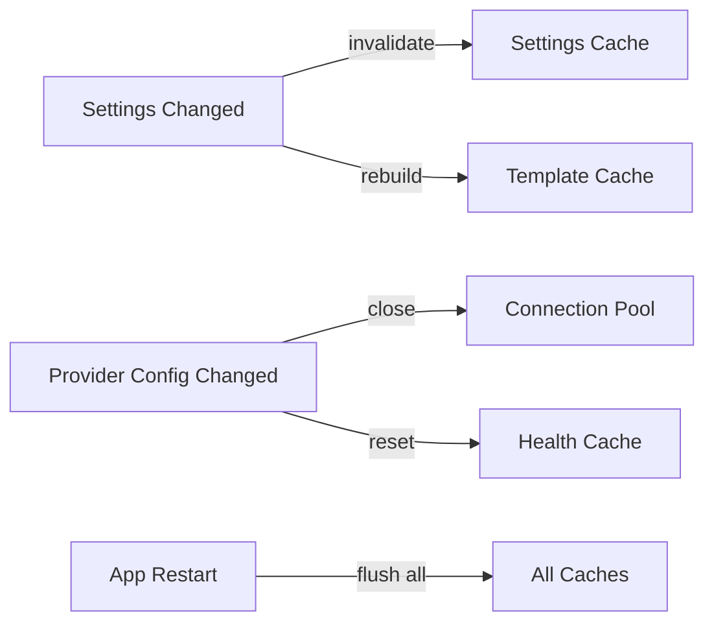
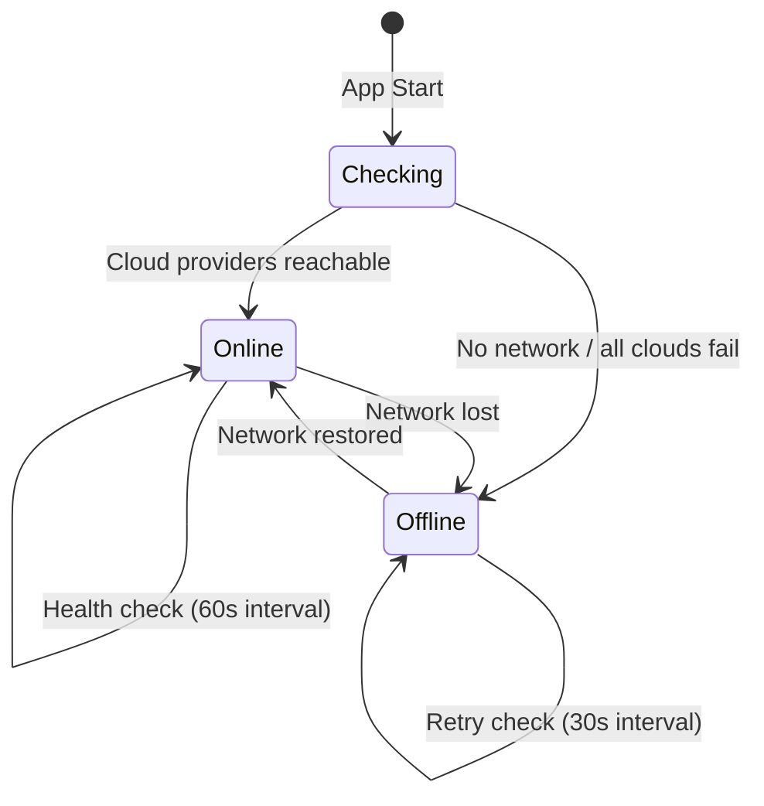
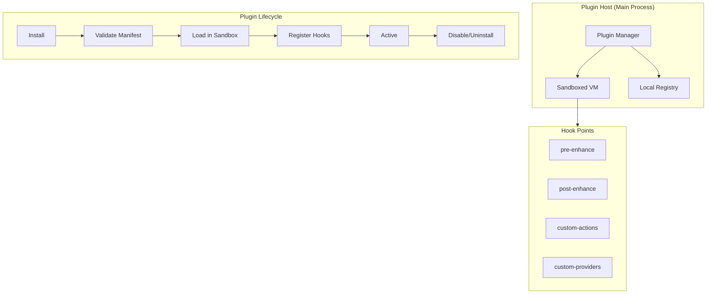

<div align="center">

# PromptForge AI — Design Document

**Combined UI/UX Design System & System Architecture**

</div>

---

## Table of Contents

- [Part 1: UI/UX Design System](#part-1-uiux-design-system)
  - [Design Principles](#design-principles)
  - [Color Palette](#color-palette)
  - [Typography](#typography)
  - [Spacing Scale](#spacing-scale)
  - [Component Inventory](#component-inventory)
  - [Animation Guidelines](#animation-guidelines)
  - [Accessibility](#accessibility)
  - [Iconography](#iconography)
- [Part 2: System Design](#part-2-system-design)
  - [High-Level Architecture](#high-level-architecture)
  - [Module Dependency Graph](#module-dependency-graph)
  - [State Management Architecture](#state-management-architecture)
  - [Event-Driven Communication](#event-driven-communication)
  - [Data Flow: Enhancement Lifecycle](#data-flow-enhancement-lifecycle)
  - [Error Handling Strategy](#error-handling-strategy)
  - [Caching Strategy](#caching-strategy)
  - [Offline/Online Modes](#offlineonline-modes)
  - [Plugin Architecture (v2)](#plugin-architecture-v2-future)

---

## Part 1: UI/UX Design System

### Design Principles

| # | Principle | Description |
|---|-----------|-------------|
| 1 | **Non-intrusive** | Never interrupt the user's workflow; overlay UI appears and disappears quickly |
| 2 | **Speed** | UI renders in <100ms, entire enhancement flow completes in <2s |
| 3 | **Minimal** | Show only what's needed; use progressive disclosure for complexity |
| 4 | **Accessible** | Keyboard-navigable, screen reader support, proper contrast ratios |
| 5 | **Consistent** | Same interaction patterns across all UI surfaces |

---

### Color Palette

#### Dark Mode (Primary)

| Token | Hex | Usage |
|-------|-----|-------|
| `--bg` | `#0F1419` | App background (deep navy) |
| `--surface` | `#1A2332` | Card backgrounds |
| `--surface-elevated` | `#243447` | Popups, modals, command palette |
| `--primary` | `#3B82F6` | Actions, links, active states |
| `--primary-hover` | `#2563EB` | Hover state for primary elements |
| `--success` | `#10B981` | Success indicators, confirmations |
| `--warning` | `#F59E0B` | Warnings, caution states |
| `--error` | `#EF4444` | Errors, destructive actions |
| `--text-primary` | `#F1F5F9` | Headings, body text |
| `--text-secondary` | `#94A3B8` | Descriptions, labels |
| `--text-muted` | `#64748B` | Placeholders, disabled text |
| `--border` | `#334155` | Dividers, input borders |

#### Light Mode (Secondary)

| Token | Hex | Usage |
|-------|-----|-------|
| `--bg` | `#FFFFFF` | App background |
| `--surface` | `#F8FAFC` | Card backgrounds |
| `--surface-elevated` | `#FFFFFF` | Popups (with `box-shadow`) |
| `--primary` | `#2563EB` | Actions, links |
| `--text-primary` | `#0F172A` | Headings, body text |
| `--text-secondary` | `#475569` | Descriptions, labels |
| `--border` | `#E2E8F0` | Dividers, input borders |

#### CSS Custom Properties

```css
:root {
  /* Dark mode (default) */
  --color-bg: #0F1419;
  --color-surface: #1A2332;
  --color-surface-elevated: #243447;
  --color-primary: #3B82F6;
  --color-primary-hover: #2563EB;
  --color-success: #10B981;
  --color-warning: #F59E0B;
  --color-error: #EF4444;
  --color-text-primary: #F1F5F9;
  --color-text-secondary: #94A3B8;
  --color-text-muted: #64748B;
  --color-border: #334155;
}

[data-theme="light"] {
  --color-bg: #FFFFFF;
  --color-surface: #F8FAFC;
  --color-surface-elevated: #FFFFFF;
  --color-primary: #2563EB;
  --color-primary-hover: #1D4ED8;
  --color-success: #059669;
  --color-warning: #D97706;
  --color-error: #DC2626;
  --color-text-primary: #0F172A;
  --color-text-secondary: #475569;
  --color-text-muted: #94A3B8;
  --color-border: #E2E8F0;
}
```

---

### Typography

#### Font Stacks

```css
:root {
  --font-sans: -apple-system, BlinkMacSystemFont, 'Segoe UI', Roboto,
               Oxygen, Ubuntu, Cantarell, sans-serif;
  --font-mono: 'JetBrains Mono', 'Fira Code', 'Cascadia Code',
               'SF Mono', Consolas, monospace;
}
```

#### Type Scale

| Token | Size | Weight | Usage |
|-------|------|--------|-------|
| `--text-xs` | 12px | 400 | Badges, timestamps |
| `--text-sm` | 13px | 400 | Labels, helper text |
| `--text-base` | 14px | 400 | Body text, inputs |
| `--text-lg` | 16px | 500 | Section headers |
| `--text-xl` | 20px | 600 | Page titles |
| `--text-2xl` | 24px | 700 | Main headings |

#### Line Heights

- Body text: `1.4`
- Headings: `1.2`
- Monospace / code blocks: `1.6`

---

### Spacing Scale

Base unit: **4px**

| Token | Value | Usage |
|-------|-------|-------|
| `--space-xs` | 4px | Inline spacing, icon gaps |
| `--space-sm` | 8px | Tight padding, small gaps |
| `--space-md` | 12px | Default padding |
| `--space-lg` | 16px | Card padding, section gaps |
| `--space-xl` | 24px | Section spacing |
| `--space-2xl` | 32px | Major section dividers |
| `--space-3xl` | 48px | Page-level spacing |

---


### Component Inventory

#### 1. Floating Popup (Enhancement Result)

The primary UI surface users interact with after triggering an enhancement.

| Property | Value |
|----------|-------|
| Width | 400px |
| Max Height | 300px (scrollable) |
| Position | Near cursor / text selection |
| Border Radius | 12px |
| Shadow | `0 20px 60px rgba(0, 0, 0, 0.3)` |
| Backdrop | `blur(12px)` |
| Auto-dismiss | 30s timeout or click outside |

**Structure:**

```
┌─────────────────────────────────────────┐
│ ┌─ Provider Badge ──┐   ┌─ Actions ──┐ │
│ │ ⚡ Ollama/llama3  │   │ Copy │ ✕   │ │
│ └───────────────────┘   └────────────┘ │
├─────────────────────────────────────────┤
│                                         │
│  Enhanced prompt text appears here      │
│  with syntax highlighting for code      │
│  blocks and proper formatting...        │
│                                         │
├─────────────────────────────────────────┤
│  [✓ Accept]  [✕ Reject]  [✎ Edit]     │
│                          Processing: 1.2s│
└─────────────────────────────────────────┘
```

**States:**
- Loading: Skeleton shimmer + "Enhancing..." text
- Success: Shows enhanced text with diff highlights
- Error: Red border, error message, retry button
- Streaming: Text appears progressively (typewriter)

---

#### 2. Command Palette

A VS Code-style palette for accessing all actions.

| Property | Value |
|----------|-------|
| Width | 500px |
| Max Height | 400px |
| Position | Center-top (120px from top) |
| Border Radius | 12px |
| Animation | Slide down + fade in (150ms) |

**Structure:**

```
┌─────────────────────────────────────────────┐
│ 🔍 Type a command...                    ⌘P  │
├─────────────────────────────────────────────┤
│  ⚡ Enhance Prompt          Ctrl+Shift+E    │
│  📐 Expand Prompt           Ctrl+Shift+X    │
│  📦 Compress Prompt         Ctrl+Shift+C    │
│  ─────────────────────────────────────────  │
│  📋 Templates               Ctrl+Shift+T    │
│  🕐 History                 Ctrl+Shift+H    │
│  ⚙️ Settings                Ctrl+,          │
└─────────────────────────────────────────────┘
```

**Keyboard Navigation:**
- `↑` / `↓` — Move selection
- `Enter` — Execute selected command
- `Escape` — Dismiss palette
- Type to filter commands (fuzzy search)

---

#### 3. Settings Window

A dedicated BrowserWindow for app configuration.

| Property | Value |
|----------|-------|
| Size | 800×600px (resizable, min 640×480) |
| Layout | Sidebar (200px) + Content area |
| Window | Frameless with custom titlebar |

**Sidebar Sections:**

| Section | Contents |
|---------|----------|
| General | Theme, language, startup behavior, update settings |
| Providers | AI provider configuration, API keys, model selection |
| Hotkeys | Global shortcut customization with conflict detection |
| Templates | Manage, create, import/export prompt templates |
| History | Retention policy, export, clear history |
| About | Version, licenses, links |

---

#### 4. System Tray

Always-running tray icon for background access.

| Property | Value |
|----------|-------|
| Icon Size | 16×16 (standard), 32×32 (retina) |
| Menu | Native context menu |

**Menu Items:**
- Status indicator (● Online / ○ Offline)
- Active provider display
- Quick toggle: Enable/Disable hotkeys
- Open Settings
- View History
- Separator
- Quit PromptForge

---

#### 5. Toast Notifications

Non-blocking feedback for background operations.

| Property | Value |
|----------|-------|
| Position | Bottom-right, 16px from edges |
| Width | 320px |
| Border Radius | 8px |
| Duration | 3s (info/success), 5s (error/warning) |
| Stack | Max 3 visible, oldest dismissed first |

**Types:**

| Type | Icon | Border Color | Use Case |
|------|------|--------------|----------|
| Success | ✓ | `--success` | Enhancement complete, copy confirmed |
| Error | ✕ | `--error` | Provider failure, network error |
| Warning | ⚠ | `--warning` | Fallback provider used, rate limit |
| Info | ℹ | `--primary` | Update available, tips |

---


### Animation Guidelines

| Category | Duration | Easing |
|----------|----------|--------|
| Micro-interactions (hover, focus) | 100–150ms | `cubic-bezier(0.4, 0, 0.2, 1)` |
| Panel open/close | 150–200ms | `cubic-bezier(0, 0, 0.2, 1)` |
| Page transitions | 200–300ms | `cubic-bezier(0.4, 0, 0.2, 1)` |
| Loading states | 1000ms (loop) | `linear` |

**Rules:**
- Respect `prefers-reduced-motion: reduce` — disable **all** animations
- No layout-shifting transforms (avoid `scale` on hover for interactive elements)
- Use `opacity` and `transform: translateY()` for enter/exit
- Never animate `width`, `height`, or `top`/`left` directly (use `transform`)

```css
@media (prefers-reduced-motion: reduce) {
  *, *::before, *::after {
    animation-duration: 0.01ms !important;
    animation-iteration-count: 1 !important;
    transition-duration: 0.01ms !important;
  }
}
```

---

### Accessibility

#### Contrast Requirements

| Element | Minimum Ratio | Standard |
|---------|---------------|----------|
| Body text | 4.5:1 | WCAG AA |
| Large text (18px+) | 3:1 | WCAG AA |
| UI components | 3:1 | WCAG AA |
| Focus indicators | 3:1 | WCAG AA |

#### Focus Management

```css
:focus-visible {
  outline: 2px solid var(--color-primary);
  outline-offset: 2px;
  border-radius: 4px;
}
```

#### Keyboard Navigation

| Context | Key | Action |
|---------|-----|--------|
| Global | `Ctrl+Shift+P` | Open command palette |
| Global | `Escape` | Dismiss active overlay |
| Palette | `↑` / `↓` | Navigate items |
| Palette | `Enter` | Select item |
| Popup | `Tab` | Cycle through actions |
| Popup | `Ctrl+C` | Copy enhanced text |
| Popup | `Enter` | Accept enhancement |
| Popup | `Escape` | Reject and dismiss |

#### Screen Reader Support

- All interactive elements have `aria-label` or `aria-labelledby`
- Live regions (`aria-live="polite"`) for enhancement results
- Role annotations on custom components (`role="dialog"`, `role="listbox"`)
- Status announcements for loading/success/error states

---

### Iconography

| Guideline | Specification |
|-----------|---------------|
| Icon set | [Lucide Icons](https://lucide.dev/) (consistent stroke style) |
| Size | 16×16 (inline), 20×20 (buttons), 24×24 (headers) |
| Stroke width | 1.5px (default), 2px (emphasis) |
| Color | Inherits from `currentColor` |
| Format | Inline SVG (no icon fonts) |

**No emoji icons in the UI.** Use SVG icons exclusively for all interface elements.

---


## Part 2: System Design

### High-Level Architecture



---

### Module Dependency Graph



---


### State Management Architecture

#### Renderer Process (Zustand Stores)

```typescript
// Store definitions
interface StoreMap {
  useSettingsStore: SettingsState;   // Theme, hotkeys, provider config
  useHistoryStore: HistoryState;    // Enhancement history, search, filters
  useProviderStore: ProviderState;  // Active provider, health status, models
  useUIStore: UIState;              // Palette visibility, toast queue, active popup
}
```

#### Store Responsibilities

| Store | Owns | Syncs With |
|-------|------|------------|
| `useSettingsStore` | User preferences, hotkey bindings | Main process (SQLite) via IPC |
| `useHistoryStore` | Enhancement records, search state | Main process (SQLite) via IPC |
| `useProviderStore` | Provider status, active model | Main process (health checks) |
| `useUIStore` | Overlay visibility, toasts, theme | Local only (ephemeral) |

#### IPC Sync Pattern



#### Source of Truth

| Data | Source of Truth | Reason |
|------|-----------------|--------|
| Hotkey registrations | Main process | OS-level global shortcuts |
| Clipboard content | Main process | Native clipboard access |
| Provider health | Main process | Background polling |
| UI state (visibility) | Renderer | Ephemeral, display-only |
| Settings | Main process (SQLite) | Persisted, shared across windows |
| History | Main process (SQLite) | Persisted, queryable |

---

### Event-Driven Communication

#### IPC Channel Map

| Channel | Direction | Payload | Purpose |
|---------|-----------|---------|---------|
| `enhance:request` | Renderer → Main | `{ text, mode, template? }` | Trigger enhancement |
| `enhance:result` | Main → Renderer | `{ enhanced, provider, duration }` | Return result |
| `enhance:stream` | Main → Renderer | `{ chunk, done }` | Streaming response |
| `enhance:error` | Main → Renderer | `{ code, message, retry }` | Error notification |
| `settings:get` | Renderer → Main | `{ key? }` | Read settings |
| `settings:update` | Renderer → Main | `{ key, value }` | Write settings |
| `settings:changed` | Main → Renderer | `{ key, value }` | Broadcast change |
| `history:query` | Renderer → Main | `{ filter, page, limit }` | Query history |
| `provider:status` | Main → Renderer | `{ providers: Status[] }` | Health update |
| `hotkey:triggered` | Main → Renderer | `{ action, context }` | Hotkey fired |

#### Internal Event Bus (Main Process)



#### Communication Pattern

```
User Action → Hotkey Manager → Event Bus → Enhance Service → Provider
                                                                 ↓
UI Update ← Window Manager ← Event Bus ← History Save ← Result
```

---


### Data Flow: Enhancement Lifecycle



---

### Error Handling Strategy

#### Error Layers



#### Error Classification

| Error Type | Strategy | User Impact |
|-----------|----------|-------------|
| Network timeout | Retry 3x with exponential backoff (1s, 2s, 4s) | Toast: "Retrying..." |
| Provider unavailable | Automatic fallback to next provider | Toast: "Using fallback provider" |
| Rate limit (429) | Queue request, wait `Retry-After` | Toast: "Rate limited, waiting..." |
| Invalid API key | Disable provider, prompt reconfiguration | Settings redirect with error |
| Clipboard access denied | Show manual copy instructions | Popup with copyable text |
| Model not found | Suggest alternative models | Settings redirect |
| Out of memory (Ollama) | Suggest smaller model | Error dialog with guidance |
| SQLite corruption | Backup + recreate database | Data loss warning |

#### Provider Fallback Chain

```typescript
// Default fallback order (user-configurable)
const fallbackChain = [
  'ollama',      // Local first (fastest, private)
  'groq',       // Fast cloud inference
  'openai',     // Reliable cloud
  'anthropic',  // Alternative cloud
  'openrouter', // Multi-model router (last resort)
];
```

#### Exponential Backoff Implementation

```typescript
async function withRetry<T>(
  fn: () => Promise<T>,
  maxAttempts: number = 3,
  baseDelay: number = 1000
): Promise<T> {
  for (let attempt = 0; attempt < maxAttempts; attempt++) {
    try {
      return await fn();
    } catch (error) {
      if (attempt === maxAttempts - 1) throw error;
      const delay = baseDelay * Math.pow(2, attempt);
      await sleep(delay + Math.random() * 500); // Jitter
    }
  }
  throw new Error('Unreachable');
}
```

---

### Caching Strategy

| Cache | Type | Size Limit | TTL | Eviction |
|-------|------|-----------|-----|----------|
| Template compilation | In-memory LRU | 100 entries | Session | Least recently used |
| Provider connections | Keep-alive pool | 1 per provider | 60s idle | Close on idle timeout |
| Recent prompts | In-memory ring buffer | 10 entries | Session | Oldest first |
| Settings | In-memory mirror | All settings | Infinite | Overwrite on change |
| Provider health | In-memory | Per provider | 60s | Refresh on interval |

#### Cache Invalidation



#### Undo Support

The ring buffer of recent prompts enables instant undo:

```typescript
interface PromptCacheEntry {
  id: string;
  originalText: string;
  enhancedText: string;
  provider: string;
  timestamp: number;
}

// Last 10 enhancements stored for instant undo
const recentEnhancements = new RingBuffer<PromptCacheEntry>(10);
```

---

### Offline/Online Modes

#### Mode Detection



#### Feature Availability Matrix

| Feature | Offline | Online |
|---------|---------|--------|
| Enhance with Ollama | ✅ | ✅ |
| Enhance with LM Studio | ✅ | ✅ |
| Enhance with cloud providers | ❌ (grayed out) | ✅ |
| Command palette | ✅ | ✅ |
| Templates | ✅ | ✅ |
| History (read/write) | ✅ | ✅ |
| Settings | ✅ | ✅ |
| Provider health checks | ❌ | ✅ |
| Auto-update check | ❌ | ✅ |

#### UI Indicators

- **System tray icon**: Filled circle (● Online) vs hollow circle (○ Offline)
- **Settings panel**: Offline badge on unavailable providers
- **Command palette**: Disabled commands show "(offline)" suffix
- **Toast on transition**: "Switched to offline mode — local providers only"

#### Graceful Degradation

```typescript
// Provider selection with offline awareness
function selectProvider(mode: 'offline' | 'online'): Provider {
  if (mode === 'offline') {
    // Only return local providers
    return getFirstHealthy(['ollama', 'lmstudio']);
  }
  // Return based on user preference + fallback chain
  return getFirstHealthy(userPreferenceOrder);
}
```

---


### Plugin Architecture (v2, Future)

#### Overview

The plugin system enables third-party extensions without compromising app stability or security.



#### Plugin Manifest Format

```jsonc
// plugin.json
{
  "name": "my-custom-plugin",
  "version": "1.0.0",
  "displayName": "My Custom Plugin",
  "description": "Adds custom enhancement modes",
  "author": "developer@example.com",
  "main": "./dist/index.js",
  "hooks": ["pre-enhance", "post-enhance", "custom-actions"],
  "permissions": [
    "clipboard:read",
    "network:localhost",
    "storage:plugin-data"
  ],
  "config": {
    "apiEndpoint": {
      "type": "string",
      "default": "http://localhost:8080",
      "description": "Custom API endpoint"
    }
  },
  "engines": {
    "promptforge": ">=1.0.0"
  }
}
```

#### Hook API

```typescript
// Plugin hook interface
interface PluginHooks {
  /** Modify text before sending to AI provider */
  'pre-enhance'?: (context: PreEnhanceContext) => Promise<string>;

  /** Transform or log the result after enhancement */
  'post-enhance'?: (context: PostEnhanceContext) => Promise<string>;

  /** Register new commands in the command palette */
  'custom-actions'?: () => CustomAction[];

  /** Register a custom AI provider */
  'custom-providers'?: () => ProviderDefinition[];
}

interface PreEnhanceContext {
  text: string;
  mode: EnhanceMode;
  sourceApp: string;
  template: string | null;
}

interface PostEnhanceContext {
  original: string;
  enhanced: string;
  provider: string;
  duration: number;
}

interface CustomAction {
  id: string;
  label: string;
  shortcut?: string;
  icon?: string;
  handler: (selectedText: string) => Promise<string>;
}
```

#### Security Sandbox

| Restriction | Enforcement |
|-------------|-------------|
| No filesystem access | VM sandbox with no `fs` module |
| No arbitrary network | Only whitelisted domains from manifest |
| Memory limit | 50MB per plugin |
| Execution timeout | 10s per hook invocation |
| No native modules | Pure JavaScript/TypeScript only |
| Isolated storage | Scoped `localStorage`-like API per plugin |

#### Plugin Store (Local Registry)

```
~/.promptforge/plugins/
├── registry.json          # Installed plugins index
├── my-custom-plugin/
│   ├── plugin.json        # Manifest
│   ├── dist/
│   │   └── index.js       # Compiled plugin code
│   └── data/              # Plugin-scoped storage
└── another-plugin/
    ├── plugin.json
    └── dist/
        └── index.js
```

---

## Appendix

### Design Tokens Summary (Tailwind Config)

```javascript
// tailwind.config.js (relevant excerpt)
module.exports = {
  theme: {
    extend: {
      colors: {
        bg: 'var(--color-bg)',
        surface: 'var(--color-surface)',
        'surface-elevated': 'var(--color-surface-elevated)',
        primary: 'var(--color-primary)',
        'primary-hover': 'var(--color-primary-hover)',
        success: 'var(--color-success)',
        warning: 'var(--color-warning)',
        error: 'var(--color-error)',
      },
      textColor: {
        primary: 'var(--color-text-primary)',
        secondary: 'var(--color-text-secondary)',
        muted: 'var(--color-text-muted)',
      },
      borderColor: {
        DEFAULT: 'var(--color-border)',
      },
      fontFamily: {
        sans: ['var(--font-sans)'],
        mono: ['var(--font-mono)'],
      },
      fontSize: {
        xs: '12px',
        sm: '13px',
        base: '14px',
        lg: '16px',
        xl: '20px',
        '2xl': '24px',
      },
      spacing: {
        xs: '4px',
        sm: '8px',
        md: '12px',
        lg: '16px',
        xl: '24px',
        '2xl': '32px',
        '3xl': '48px',
      },
      borderRadius: {
        sm: '4px',
        DEFAULT: '8px',
        lg: '12px',
      },
      transitionTimingFunction: {
        standard: 'cubic-bezier(0.4, 0, 0.2, 1)',
        decelerate: 'cubic-bezier(0, 0, 0.2, 1)',
      },
    },
  },
};
```

### Performance Budgets

| Metric | Target | Measurement |
|--------|--------|-------------|
| Popup render | <100ms | Time from hotkey to visible popup |
| Enhancement E2E (local) | <2s | Hotkey to result displayed |
| Enhancement E2E (cloud) | <4s | Hotkey to result displayed |
| Command palette open | <50ms | Keypress to visible palette |
| Settings window load | <300ms | Click to interactive |
| Memory (idle) | <80MB | Electron baseline + app |
| Memory (active) | <150MB | During enhancement |
| Tray startup | <500ms | Login to tray icon visible |

---

<div align="center">

*This document is the source of truth for all UI/UX decisions and system architecture in PromptForge AI.*

**Last updated:** 2025-07-05

</div>
