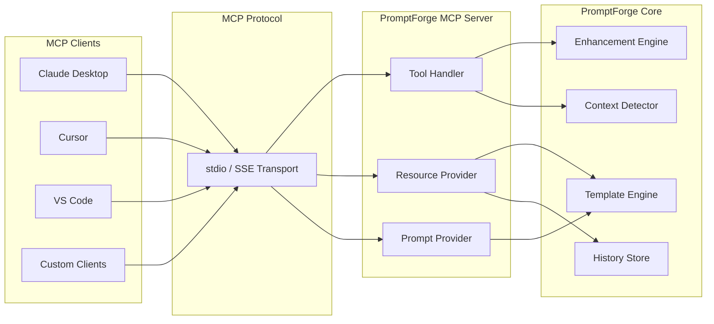

# MCP Integration (Planned)

> **⚠️ This feature is planned for v2.0 and is not yet implemented.**
> This document describes the intended design for community feedback and discussion.

---

## What is MCP?

[Model Context Protocol (MCP)](https://modelcontextprotocol.io/) is an open protocol created by Anthropic that enables seamless integration between LLM applications and external data sources and tools. It provides a standardized way for AI models to:

- **Tools** — Call functions and perform actions
- **Resources** — Access data sources and files
- **Prompts** — Use pre-built prompt templates

MCP follows a client-server architecture where host applications (like Claude Desktop or Cursor) connect to MCP servers that expose capabilities through a unified protocol.

---

## Why PromptForge as an MCP Server?

By exposing PromptForge AI as an MCP server, any MCP-compatible client (Claude Desktop, Cursor, VS Code with Copilot, etc.) can:

- **Enhance prompts** directly from within their interface
- **Access PromptForge's template library** without switching applications
- **Leverage context detection** for better prompt engineering
- **Query enhancement history** for reference and iteration

This turns PromptForge from a hotkey-triggered tool into a **universal prompt engineering service** accessible from any AI-powered application.

---

## Planned Architecture



---

## Planned Tools

### `enhance_prompt`

Enhance an AI prompt for clarity, specificity, and effectiveness.

```json
{
  "name": "enhance_prompt",
  "description": "Enhance an AI prompt for clarity, specificity, and effectiveness",
  "inputSchema": {
    "type": "object",
    "properties": {
      "text": {
        "type": "string",
        "description": "The prompt text to enhance"
      },
      "mode": {
        "type": "string",
        "enum": ["enhance", "expand", "compress", "explain"],
        "default": "enhance"
      },
      "category": {
        "type": "string",
        "enum": ["coding", "writing", "research", "marketing", "general"]
      },
      "template_id": {
        "type": "string",
        "description": "Specific template to use for enhancement"
      }
    },
    "required": ["text"]
  }
}
```

### `detect_context`

Classify a prompt into a category for optimal enhancement strategy selection.

```json
{
  "name": "detect_context",
  "description": "Classify a prompt into a category for optimal enhancement",
  "inputSchema": {
    "type": "object",
    "properties": {
      "text": {
        "type": "string",
        "description": "Text to classify"
      }
    },
    "required": ["text"]
  }
}
```

### `list_templates`

List available prompt enhancement templates, optionally filtered by category.

```json
{
  "name": "list_templates",
  "description": "List available prompt enhancement templates",
  "inputSchema": {
    "type": "object",
    "properties": {
      "category": {
        "type": "string",
        "description": "Filter by category"
      }
    }
  }
}
```

### `search_history`

Search through prompt enhancement history for past results.

```json
{
  "name": "search_history",
  "description": "Search prompt enhancement history",
  "inputSchema": {
    "type": "object",
    "properties": {
      "query": {
        "type": "string",
        "description": "Search query to match against history entries"
      },
      "limit": {
        "type": "number",
        "default": 10,
        "description": "Maximum number of results to return"
      }
    },
    "required": ["query"]
  }
}
```

---

## Planned Resources

### `templates://`

Access the prompt template library as MCP resources.

| URI | Description |
|-----|-------------|
| `templates://list` | List all available templates |
| `templates://{id}` | Get a specific template with full details |
| `templates://category/{category}` | Templates filtered by category |

### `history://`

Access prompt enhancement history as MCP resources.

| URI | Description |
|-----|-------------|
| `history://recent` | Last 10 enhancements |
| `history://{id}` | Specific history entry with before/after |
| `history://favorites` | Favorited enhancements |

---

## Planned Prompts

Pre-built prompts exposed via MCP for common prompt engineering use cases:

| Prompt | Description |
|--------|-------------|
| `enhance-for-coding` | Optimize a prompt for code generation tasks |
| `enhance-for-writing` | Optimize a prompt for creative writing |
| `enhance-for-research` | Optimize a prompt for research and analysis |
| `prompt-review` | Review and score a prompt's effectiveness |

---

## Transport

| Transport | Use Case | Status |
|-----------|----------|--------|
| **stdio** | CLI tools, editor integrations (Cursor, VS Code) | Planned |
| **SSE (HTTP)** | Network access, remote clients, web integrations | Planned |

The stdio transport will be the primary integration method, suitable for local editor plugins. SSE will enable network-based access for remote or multi-machine setups.

---

## Configuration

Once implemented, MCP clients will be able to connect to PromptForge using standard MCP configuration:

```json
{
  "mcpServers": {
    "promptforge": {
      "command": "promptforge-mcp",
      "args": ["--port", "9877"],
      "env": {
        "PROMPTFORGE_API_TOKEN": "your-local-api-token"
      }
    }
  }
}
```

> **Note:** The `PROMPTFORGE_API_TOKEN` is a locally-generated token for authenticating MCP clients against your local PromptForge instance. No data is sent to external servers.

---

## Implementation Roadmap

The MCP integration will be delivered in phases:

| Phase | Scope | Target |
|-------|-------|--------|
| **Phase 1** | Core tools (`enhance_prompt`, `detect_context`) | v2.0-alpha |
| **Phase 2** | Resource exposure (templates, history) | v2.0-beta |
| **Phase 3** | Pre-built prompts and prompt sharing | v2.0-rc |
| **Phase 4** | SSE transport for network access | v2.0 |

---

## References

- [MCP Specification](https://modelcontextprotocol.io/specification)
- [MCP TypeScript SDK](https://github.com/modelcontextprotocol/typescript-sdk)
- [Building MCP Servers](https://modelcontextprotocol.io/docs/learn/server-concepts)
- [PromptForge API Reference](./API.md)

---

## Contributing

Want to help build the MCP integration? Check the [Contributing Guide](./CONTRIBUTING.md) and look for issues tagged with the `mcp` label.

We're especially looking for feedback on:
- Tool schema design and naming conventions
- Resource URI structure
- Priority of transport implementations
- Additional tools or resources that would be valuable

---

*This document will be updated as the design evolves. Last updated: July 2026.*
