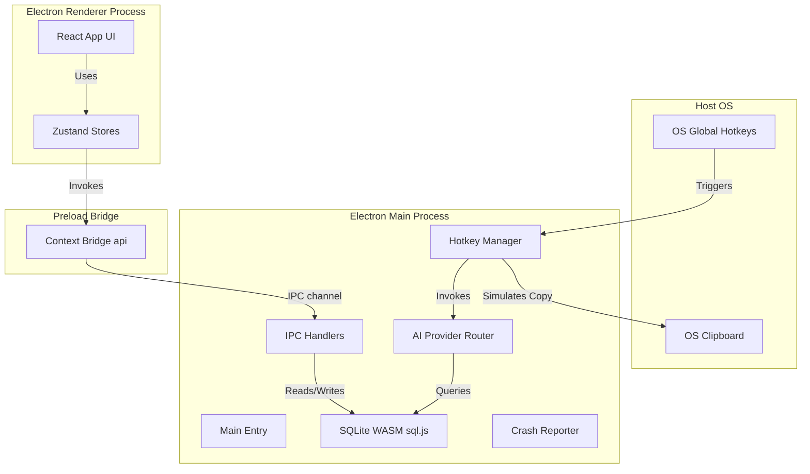
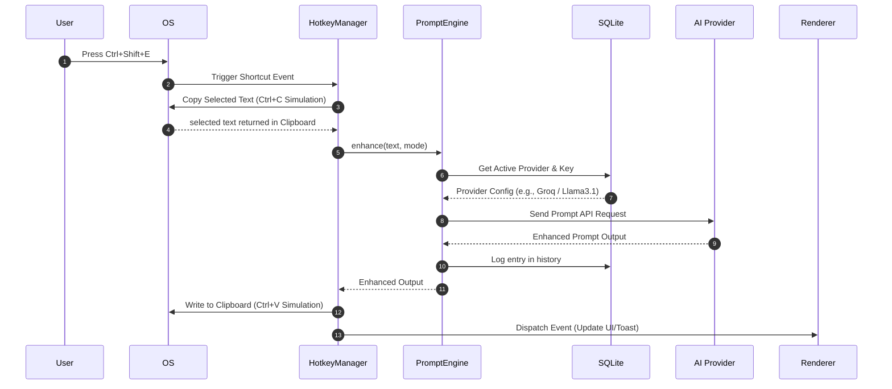

<div align="center">


# PromptForge AI

### **Forge Better Prompts. Get Better Results.**

*Enhance any prompt, from any application, with a single global hotkey.*

[](./LICENSE)
[](#installation)
[](./docs/CHANGELOG.md)
[](./docs/BRANDING.md)
[](./docs/CONTRIBUTING.md)

</div>

---

PromptForge AI is an enterprise-grade, local-first desktop application that supercharges your prompt engineering workflow. Highlight text in any application (e.g. VS Code, Slack, Chrome), press a global hotkey, and instantly get back a formatted, optimized prompt on your clipboard. 

All settings, templates, and history are kept locally in a secure SQLite database. Cloud APIs are accessed directly from your machine with safely encrypted keys.

---

## ✨ Key Features

- **🌐 Universal System Hotkeys**: Instantly capture selections from any active window and overwrite or copy back the result.
- **🔒 Local-First & Private**: Local history search (FTS5) and templates. API keys are safely encrypted using Electron's `safeStorage`.
- **🤖 Native Provider Integrations**: Out-of-the-box support for Ollama (local offline), Groq, OpenAI, and OpenRouter, with active fallback routing.
- **📝 Custom & Built-In Templates**: Easily create, interpolate, and execute custom prompt templates.
- **📊 Structed Local Logger & Diagnostics**: Embedded `doctor` script verifies environment health; crash reports catch unhandled states.
- **🧪 Production-Ready Validation**: Strict quality gates in CI/CD, 90%+ unit test coverage, Axe accessibility audits, and mutation tests.

---

## 🏗️ Architecture & Data Flow

PromptForge AI divides responsibility into an isolated Main process (Node.js/APIs/Hotkeys), a secure Preload bridge, and a sandboxed React UI.

### Component Architecture



### Execution Sequence (Headless Enhancement Loop)



---

## 📁 Repository Structure

```
├── .github/                  # GitHub Actions, Issue forms & Community standards
├── .vscode/                  # Shared VSCode debuggers, settings, & recommendations
├── docs/                     # System specifications & guidelines
│   ├── design/               # UI design system tokens, typography & motion guidelines
│   ├── API.md                # Local Fastify API documentation
│   ├── ARCHITECTURE.md       # Technical design patterns & structures
│   ├── DATABASE_SCHEMA.md    # SQLite tables & indexes
│   └── CONTRIBUTING.md       # Guidelines for code contributions
├── migrations/               # SQLite database schemas and migrations
├── resources/                # App installer icons & resource media
├── scripts/                  # Onboarding diagnostics & SBOM generators
├── src/
│   ├── main/                 # Electron Main Process (system events, IPC, tray)
│   ├── preload/              # Secure Electron Context Bridge API
│   ├── renderer/             # React/Tailwind UI & state stores
│   ├── services/             # Core business logic (DB services, AI adapters)
│   └── shared/               # Shared constants, Zod validations, & types
├── tests/                    # Testing suites
│   ├── unit/                 # Vitest isolated business logic tests
│   ├── integration/          # SQLite database & router fallback integration tests
│   └── e2e/                  # Playwright browser & Electron accessibility tests
├── package.json              # Project scripts and configurations
└── eslint.config.js          # ESLint flat config definition
```

---

## 🚀 Getting Started

### Prerequisites

| Requirement | Version | Purpose |
|---|---|---|
| **Node.js** | `>= 20.0.0` | Runtime environment |
| **npm** | `>= 9.0.0` | Package manager |
| **Ollama** | Latest | (Optional) Local offline inference |

### Developer Installation

1. **Clone the Repository:**
   ```bash
   git clone https://github.com/IrfanCodesBTW/PromptForge-AI.git
   cd PromptForge-AI
   ```

2. **Install Dependencies:**
   ```bash
   npm install
   ```

3. **Verify Environment Health:**
   ```bash
   npm run doctor
   ```

4. **Start in Development Mode:**
   ```bash
   npm run dev
   ```

5. **Build & Package Installers:**
   ```bash
   # Build production assets
   npm run build
   
   # Compile installers (Windows, macOS, Linux)
   npm run package
   ```

---

## ⚙️ Configuration

Copy `.env.example` to `.env` to configure cloud providers:
```bash
cp .env.example .env
```

| Environment Variable | Description |
|---|---|
| `GROQ_API_KEY` | Key for high-speed Groq inference |
| `OPENAI_API_KEY` | Key for OpenAI models |
| `OPENROUTER_API_KEY` | Key for OpenRouter endpoint |
| `GEMINI_API_KEY` | Key for Google Gemini API |
| `ANTHROPIC_API_KEY` | Key for Anthropic Claude |

---

## ⌨️ Global Hotkeys

| Shortcut | Action | Description |
|---|---|---|
| `Ctrl+Shift+E` | **Enhance** | Optimizes highlighted text for clarity and structure |
| `Ctrl+Shift+X` | **Expand** | Expands rough notes into detailed instructions |
| `Ctrl+Shift+K` | **Compress** | Distills long prompts down to their essential tokens |
| `Ctrl+Shift+P` | **Palette** | Launches the floating command palette overlay |
| `Escape` | **Dismiss** | Hides palette overlay or cancels active runs |

*Note: On macOS, substitute `Ctrl` with `Cmd`.*

---

## 🧪 Testing and Validation

All tests are validated against strict quality gates in CI/CD.

```bash
# Run unit & integration tests
npm test

# Generate coverage reports (Target: 90%+)
npm run coverage

# Run circular dependency checks
npm run analyze

# Run Playwright E2E and Axe accessibility tests
npx playwright test

# Check for unused exports and code dependencies
npm run deps

# Check third-party dependency licenses
npm run licenses

# Run full preflight verification suite
npm run validate
```

---

## 🛡️ Security Policy

PromptForge AI is built with enterprise security defaults:
- **Sandbox Enabled**: Renderer processes run in a fully sandboxed context.
- **Context Isolation**: Window scripts cannot cross into Node.js runtime globals.
- **IPC Input Validation**: All arguments entering main process IPC listeners are validated using Zod.
- **API Key Encryption**: Keys stored in SQLite are encrypted on disk via Electron's `safeStorage`.
- **Secret Scanning**: Gitleaks triggers on pre-commits and CI pipelines to prevent credential commits.

---

## ❓ FAQ & Troubleshooting

### Why is copy/paste simulation not working on Linux?
Ensure you have `xdotool` and `xclip` installed on your host system:
```bash
sudo apt install xdotool xclip
```

### How are default templates loaded?
Default templates are automatically loaded into the SQLite database during the migration process at startup. You can customize them or add your own in the **Templates** view.

### Where are logs located?
- **Windows**: `%APPDATA%/promptforge-ai/logs/app.log`
- **macOS**: `~/Library/Application Support/promptforge-ai/logs/app.log`
- **Linux**: `~/.config/promptforge-ai/logs/app.log`

---

## 📄 License

Licensed under the [MIT License](./LICENSE).
