# PromptForge AI v1.5 "Intelligence" Features — Implementation Plan

> Status document. This is the canonical, confirmed plan for the four new features
> (Floating Preview Window, Multi-Turn Refinement Loop, Smart Clipboard History Stack,
> Persona Profiles). For the live checkbox tracker used during execution, see
> [`new_features_tasks.md`](../new_features_tasks.md) in the repo root.
>
> If execution ever deviates from this plan (reordering, scope changes, discovered
> blockers), update this file's "Amendments" section at the bottom rather than
> silently drifting — this file is the source of truth to come back to.

---

## Problem Statement

Add four new capabilities on top of the existing pre-release Electron app
(`package.json` v1.2.0, but `docs/ROADMAP.md` v1.0 MVP checklist ~10% complete):
real-time streaming preview, persona-based prompt identity, FTS5-powered history
search, and multi-turn conversational refinement — without destabilizing the core
enhance-via-hotkey pipeline everything depends on.

---

## Ground Truth (verified directly against the codebase)

These corrections were verified by reading the actual source before planning —
the original feature-request prose contained inaccuracies and must not be relied on:

- History table is `prompt_history` (**not** `enhancement_log`). No FTS5 virtual
  table exists anywhere in `migrations/001_initial.sql` or `002_default_templates.sql`.
  Current search in `src/services/db/history.ts` (`HistoryService.query()`) uses
  plain `LIKE '%term%'`.
- IPC channels are centrally defined in `src/shared/constants.ts` (`IPC_CHANNELS`
  object), with type signatures in `src/main/ipc/channels.ts` and Zod-validated
  handlers colocated in one file `src/main/ipc/handlers.ts`. Follow this existing
  convention — do **not** create per-feature handler files or a separate
  `ipc-channels.ts`.
- `IPC_CHANNELS` already has unused placeholders `ENHANCE_STREAM` and `WINDOW_OPEN`
  — reuse/repurpose these where sensible instead of creating redundant new ones.
- DB layer is `sql.js` (WASM SQLite), **not** better-sqlite3. It's synchronous,
  in-memory, and must be explicitly persisted via `DatabaseWrapper.save()`. The
  migration runner (`runMigrations()` in `src/services/db/database.ts`) splits each
  `.sql` file on `;` and executes statements individually inside a transaction
  wrapper, continuing past failures with a warning — any new triggers must be
  validated against this exact runner, not assumed compatible with standard
  sqlite3 tooling.
- No `AIProvider` adapter (`OllamaProvider`, `GroqProvider`, `OpenAIProvider` in
  `src/services/ai/`) implements streaming today. `complete()` always awaits one
  full response. `AIProvider` interface is in `src/services/ai/provider.ts`.
- SDK versions are pinned and already sufficient for streaming — **no upgrades
  needed**: `ollama@0.5.11` (native async generator via `client.chat({stream:true})`),
  `groq-sdk@0.8.0` and `openai@4.73.0` (both expose async-iterable
  `Stream<ChatCompletionChunk>` via `stream:true`; OpenRouter reuses the
  `OpenAIProvider` class with a custom `baseURL`).
- `HotkeyManager` (`src/main/hotkeys/manager.ts`) currently does a linear await
  chain per trigger: read clipboard → `engine.enhance()` → write clipboard →
  notify renderer. This is the integration point for the Preview Window.
- `PromptEngine.enhance()` (`src/services/prompt/engine.ts`) builds
  `systemPrompt`/`userPrompt`, optionally loads a custom template from the
  `templates` table, calls `ProviderRouter.completeWithFallback()`, cleans the
  response, and writes to `prompt_history` via `HistoryService.create()`.
- An in-app History UI **already exists**: `src/renderer/src/pages/History.tsx` +
  `src/renderer/src/stores/historyStore.ts`, using `LIKE`-based search via
  `IPC_CHANNELS.HISTORY_QUERY`. This must **not** be duplicated or forked — it must
  be migrated onto the same FTS5 backend the new Ctrl+Shift+H popup uses.
- `templates` table (see `migrations/001_initial.sql`) is the schema pattern to
  follow for `personas`. 5 built-in templates already exist (seeded in
  `migrations/002_default_templates.sql`).
- `database.ts` already has a `cleanupOldHistory()` pattern keyed off a
  `data_retention_days` setting — reuse/extend this pattern for the new
  `history_retention_days` setting rather than duplicating purge logic.
- Single `BrowserWindow` app today (`src/main/index.ts`), hidden-not-closed on
  close, `setupTray()` in `src/main/tray/tray.ts`.
- FTS5 availability inside the bundled `sql.js@1.11.0` WASM binary is
  **unverified** — this must be spiked/tested first thing in Phase 4 before
  committing further time to that phase. If FTS5 is unavailable, escalate
  immediately; do not silently substitute a workaround without flagging it.

---

## Confirmed Design Decisions (from requirements Q&A — follow exactly)

1. **Sequencing** is dependency-derived: Streaming Infra → Preview Window →
   Personas → History+FTS5 → Refinement Loop. This order is intentional (each
   phase's dependencies must be stable before the next starts) — do not reorder
   without updating this doc's Amendments section.
2. **Soft MVP gate**: Phase 0 audits that core foundations (PromptEngine,
   ProviderRouter, HotkeyManager, IPC validation, DB migrations, Settings) are
   stable. Polish items (installer, onboarding wizard) are explicitly out of
   scope / non-blocking.
3. **Execution model** is solo + AI-assisted and fully sequential — no parallel
   workstreams. Complete each phase (design → implement → test → document →
   stabilize) before starting the next.
4. **Effort sizing** is in ideal dev-days per task, summed per phase, with an
   explicit `[BUFFER]` day per phase as its own line item (not folded into task
   estimates). If a buffer is unused, it collapses into the next phase's start;
   if used, note what it was spent on in `new_features_tasks.md`.
5. `AIProvider` interface gets an **additive** optional method
   `completeStream(userPrompt, systemPrompt, options): AsyncIterable<TokenChunk>`.
   `complete()` must remain completely unchanged — this guarantees zero
   regression risk for existing callers (Settings provider test-connection, etc.).
6. Streaming fallback behavior is **hybrid**: if `completeStream()` throws, isn't
   implemented, or fails mid-stream, automatically fall back to `complete()` so
   the feature stays functional. Show a subtle non-blocking status string like
   "Streaming unavailable — displaying completed response." Do **not** show an
   error dialog unless both streaming and non-streaming completion fail. Log the
   fallback event for debugging/telemetry.
7. **History search backend must be unified**: build FTS5 into `HistoryService`,
   and migrate the existing `History.tsx`/`historyStore.ts` search to use it too
   (not just the new popup). Both consumers call the same
   `getRecentHistory(limit, query?)`-style method. UI split is purely by purpose:
   `History.tsx` keeps full CRUD/pagination/bulk-delete/retention settings; the
   new Ctrl+Shift+H popup is speed-first (top 20, keyboard nav, one-keystroke
   re-copy, no editing).
8. **Persona/Template system prompt composition order**:
   `[persona.system_prompt_injection]` + `'\n\n---\n\n'` +
   `[template.system_prompt]` — persona is the outer identity/tone frame,
   template is the task layer. If no persona is set (null/default "General"),
   behavior must be identical to V1.
9. Add `persona_override_allowed BOOLEAN DEFAULT 1` column to `templates`. In the
   **same migration's** data step, explicitly set this to `0` for the 5
   pre-existing built-in templates (Coding, Writing, Research, Marketing, General)
   so their pre-Persona behavior is preserved exactly unless a user consciously
   re-enables it. New/custom templates default to `1` (persona blending on by
   default).
10. Create `new_features_tasks.md` (repo root) in Phase 0 as a persistent,
    checkbox-based tracker — one row per task across all 6 phases, including
    `[BUFFER]` markers — so work can be resumed/audited if execution deviates
    from strict sequence.

---

## Phase Breakdown (total ~48 dev-days incl. buffers)

```mermaid
gantt
    title PromptForge AI v1.5 — Sequential Solo Roadmap (dev-days)
    dateFormat X
    axisFormat %s
    section Phase 0
    MVP Core Stability Gate (soft check)  :p0, 0, 2d
    section Phase 1
    Streaming Infrastructure              :p1, after p0, 6d
    Buffer                                :crit, p1b, after p1, 1d
    section Phase 2
    Floating Preview Window               :p2, after p1b, 8d
    Buffer                                :crit, p2b, after p2, 1d
    section Phase 3
    Persona Profiles                      :p3, after p2b, 6d
    Buffer                                :crit, p3b, after p3, 1d
    section Phase 4
    Smart History Stack + FTS5            :p4, after p3b, 8d
    Buffer                                :crit, p4b, after p4, 1d
    section Phase 5
    Multi-Turn Refinement Loop            :p5, after p4b, 8d
    Buffer                                :crit, p5b, after p5, 1d
    section Phase 6
    Integration + E2E + Docs Finalization :p6, after p5b, 4d
    Buffer                                :crit, p6b, after p6, 1d
```

| Phase | Feature | Work Days | Buffer | Cumulative |
|---|---|---|---|---|
| 0 | MVP Core Stability Gate | 2 | — | 2 |
| 1 | Streaming Infrastructure | 6 | 1 | 9 |
| 2 | Floating Preview Window | 8 | 1 | 18 |
| 3 | Persona Profiles | 6 | 1 | 25 |
| 4 | Smart History Stack + FTS5 | 8 | 1 | 34 |
| 5 | Multi-Turn Refinement Loop | 8 | 1 | 43 |
| 6 | Integration + E2E + Docs | 4 | 1 | 48 |

---

### Phase 0 — MVP Core Stability Gate (2 days, no separate buffer — this *is* the audit)

- Audit `PromptEngine`, `ProviderRouter`, `HotkeyManager`, IPC handler Zod
  validation, DB migrations, Settings for known issues/crashes.
- Confirm `npm run validate` (lint, format:check, typecheck, test, licenses)
  passes clean on current `main`.
- Create `new_features_tasks.md` tracker file with all phases/tasks below as
  checkboxes.
- Explicitly log which MVP polish items (installer, onboarding) are deferred and
  why (non-blocking).
- Fix any blocking issues found; do not proceed to Phase 1 until
  `npm run validate` is clean.

### Phase 1 — Streaming Infrastructure (6 days + 1 buffer day)

- Add optional `completeStream(userPrompt, systemPrompt, options):
  AsyncIterable<TokenChunk>` to `AIProvider` interface in
  `src/services/ai/provider.ts`. Define `TokenChunk` shape:
  `{ text: string; done: boolean; provider: string }`.
- Implement `completeStream()` in `OllamaProvider`
  (`src/services/ai/ollama.ts`) using `client.chat({..., stream: true})` async
  generator.
- Implement in `GroqProvider` (`src/services/ai/groq.ts`) using `stream: true`
  async-iterable `Stream<ChatCompletionChunk>`.
- Implement in `OpenAIProvider` (`src/services/ai/openai.ts`) — covers both
  OpenAI and OpenRouter (shared class, different `baseURL`) — using
  `stream: true`.
- Add `PromptEngine.enhanceStream()` in `src/services/prompt/engine.ts`: mirrors
  `enhance()`'s template-loading/prompt-building logic, calls
  `completeStream()` on the router-selected provider, yields chunks, applies the
  same hybrid fallback logic (auto-fallback to `complete()` on stream
  error/unavailability), still writes the final assembled result to
  `prompt_history` via `HistoryService.create()` exactly like `enhance()` does,
  still runs `cleanLLMResponse()` on the final text.
- Unit tests (Vitest) covering: happy-path streaming per provider (mocked SDK
  clients), partial-stream failure triggering fallback to `complete()`,
  empty/zero-chunk stream edge case.
- No renderer/UI changes in this phase — validate via unit tests and a small
  internal test harness only.
- `[BUFFER]` day: run `npm run validate`, fix any regressions, confirm no
  existing (non-streaming) callers are affected.

### Phase 2 — Floating Preview Window (8 days + 1 buffer day)

- Create `src/main/windows/previewWindow.ts`: new `BrowserWindow` —
  `alwaysOnTop: true`, `skipTaskbar: true`, `frame: false`, `transparent: true`,
  `resizable: false`, width 420px / max-height 280px (scrollable beyond),
  positioned at `screen.getCursorScreenPoint()` + 16px offset both axes.
  Auto-dismiss on Escape, focus loss, or Accept/Reject action.
- Add new IPC channels to `IPC_CHANNELS` in `src/shared/constants.ts`
  (reuse/repurpose existing `ENHANCE_STREAM`/`WINDOW_OPEN` placeholders where
  they fit) + corresponding Zod validation schemas added to
  `src/main/ipc/handlers.ts` (follow existing colocated convention, do not
  create new per-feature files) + type signatures in
  `src/main/ipc/channels.ts`.
- Modify `HotkeyManager.handleTrigger()` in `src/main/hotkeys/manager.ts`: after
  reading clipboard selection, spawn/reuse the preview window and call
  `engine.enhanceStream()` instead of `enhance()`; clipboard write (and
  optional auto-paste) happens only on user Accept action, not automatically.
- Renderer: new `src/renderer/preview/` entry point (separate lightweight
  window bundle from the main React app, per the "existing renderer window has
  zero awareness of preview window" requirement) — live token text display with
  blinking cursor, provider name + latency pill badge, Accept/Reject/Re-run
  buttons. Keyboard: Enter=Accept, Escape=Reject, Ctrl+R=Re-run.
- Implement hybrid fallback UI: on stream failure, show "Streaming unavailable
  — displaying completed response" status text and render the full
  `complete()`-based result at once — no error dialog.
- Error states render in `--color-error` token with a retry option (match
  existing design token usage from `src/renderer/src/index.css` / design docs
  in `docs/design/`).
- Feature-flag the preview window behind a settings toggle for initial rollout
  so users can revert to instant clipboard-write V1 behavior if issues arise.
- Tests: unit tests in `tests/unit/previewWindow.test.ts` (IPC payload
  validation, window lifecycle open/close/reopen, streaming state machine);
  Playwright E2E test for Accept/Reject flow.
- Docs: add a new section + Mermaid sequence diagram of the token streaming
  flow to `docs/ARCHITECTURE.md`.
- `[BUFFER]` day: validate multi-monitor cursor positioning, focus-loss dismiss
  edge cases, run `npm run validate` + Playwright suite.

### Phase 3 — Persona Profiles (6 days + 1 buffer day)

- New migration `migrations/003_personas.sql`: `personas` table — `id TEXT PK`,
  `name TEXT NOT NULL`, `description TEXT`, `tone TEXT CHECK(tone IN
  ('professional','casual','technical','creative','formal'))`,
  `format_rules TEXT`, `system_prompt_injection TEXT`,
  `is_default BOOLEAN DEFAULT 0`, `is_builtin BOOLEAN DEFAULT 0`,
  `created_at`, `updated_at`. Add a DB trigger enforcing single default (test
  against the actual `runMigrations()` statement-splitting runner, not assumed
  generic SQLite behavior). Add `persona_override_allowed BOOLEAN DEFAULT 1`
  column to `templates`, then explicitly
  `UPDATE templates SET persona_override_allowed = 0` for the 5 existing
  built-in templates by name/`is_builtin` flag. Seed 5 built-in personas
  (General=default, Developer, Executive, Creative, Social) with
  `is_builtin=1`.
- `src/services/db/personaService.ts`: typed CRUD — `getAll()`, `getDefault()`,
  `create(data)`, `update(id, data)`, `delete(id)`, `setDefault(id)`.
  Built-ins can be duplicated but not deleted (enforce in service layer).
- New `src/shared/schemas/persona.ts` with Zod schemas for all CRUD payloads
  (first dedicated schemas file — reasonable given growing schema count; wire
  into `handlers.ts` at the IPC boundary same as other entities).
- Update `PromptEngine.enhance()` **and** the new `enhanceStream()` (Phase 1)
  to both: fetch `personaService.getDefault()`, compose final system prompt as
  `[persona.system_prompt_injection] + '\n\n---\n\n' + [template/mode system
  prompt]` respecting `persona_override_allowed` (skip persona injection if the
  selected template has it set to `0`). Null persona = byte-identical V1
  behavior.
- Tray menu update in `src/main/tray/tray.ts`: "Persona" submenu with
  radio-button items per persona, calls `personaService.setDefault(id)`; tray
  tooltip shows active persona name.
- Settings UI: new "Personas" tab in `src/renderer/src/pages/` — two-panel
  layout (list left, editor form right): Name, Description, Tone (segmented
  control), Format Rules (textarea), System Prompt Injection (monospace
  textarea), "Set as Default" toggle, live preview panel showing persona effect
  on a sample prompt. Follow existing patterns from `Templates.tsx`
  (icon/color maps, `useInvoke` hook, `window.api.invoke`).
- Tests: `personaService` CRUD + default-enforcement-trigger unit tests;
  `PromptEngine` integration test asserting correct injection order/separator
  and override-flag behavior; snapshot test for the Settings Personas tab.
- Docs: update `docs/DATABASE_SCHEMA.md` with the `personas` table, trigger,
  and new `templates` column.
- `[BUFFER]` day: verify trigger behavior against real migration runner, run
  `npm run validate`.

### Phase 4 — Smart History Stack + FTS5 (8 days + 1 buffer day)

**4a. FTS5 data layer (prerequisite sub-phase, ~3 days) — do this first, spike
FTS5 availability on day 1 before further commitment:**

- Verify FTS5 is actually compiled into the `sql.js@1.11.0` WASM binary
  currently in use. If unavailable, **stop and escalate** — do not silently
  implement a workaround; this changes the phase's scope and estimate
  materially (add ~2 days for a ranked-LIKE fallback plan).
- If available: new migration `migrations/004_history_fts5.sql` —
  `CREATE VIRTUAL TABLE prompt_history_fts USING fts5(original_text,
  enhanced_text, content='prompt_history', content_rowid='rowid')` +
  INSERT/UPDATE/DELETE triggers to keep it synced with `prompt_history` (test
  against the real migration runner). Backfill existing rows into the FTS5
  table.
- Update `HistoryService` (`src/services/db/history.ts`): add
  `getRecentHistory(limit, query?)` — FTS5 `MATCH` + `bm25()` ranking when
  `query` provided, falls back to `ORDER BY created_at DESC LIMIT ?` otherwise.
  Migrate the existing `query()` method's `search` filter to also use FTS5
  instead of `LIKE`, so both the in-app tab and new popup share one path.

**4b. History Picker Window + UI migration (~5 days):**

- `src/main/windows/historyWindow.ts`: new transparent/always-on-top/frameless
  `BrowserWindow`, 560×480px, registered to `Ctrl+Shift+H` in `HotkeyManager`.
- Add and pin the `diff` npm package as an exact version (flag it for the
  user's `npm run licenses` check — new dependency). Build a side-by-side diff
  component (additions/deletions highlighted via
  `--color-success-highlight`/`--color-error-highlight` design tokens),
  computed client-side from `original_text`/`enhanced_text`.
- Autofocused search input, 150ms debounce, re-queries via new IPC channel
  calling `getRecentHistory()`. Highlight matched terms with `<mark>` styled
  via `--color-primary-highlight`.
- Per-entry actions: Re-copy (clipboard write + 1.5s "Copied!" toast), "Use as
  Base" (stub hook now — hands the entry to the Refinement Loop session, fully
  wired in Phase 5), Delete (removes from DB, 4s undo toast).
- Full keyboard nav: ↑/↓ navigate, Enter re-copy, Delete remove, Escape close;
  focused entry highlighted via `--color-primary-highlight` border.
- "Clear All History" button + confirmation dialog. New
  `history_retention_days` setting (default 30) — reuse/extend the existing
  `cleanupOldHistory()` pattern in `src/services/db/database.ts` (currently
  keyed on `data_retention_days`) rather than duplicating purge logic; runs on
  app startup.
- Rewire the existing `src/renderer/src/pages/History.tsx` + `historyStore.ts`
  search to call the new FTS5-backed method — backend swap only, no UI
  redesign required.
- New Zustand store slice for the history popup window state.
- Tests: FTS5 query logic unit tests; Playwright E2E for search → re-copy flow.
- Docs: update `docs/DATABASE_SCHEMA.md` (FTS5 virtual table + triggers) and
  `docs/API.md` (new IPC channels).
- `[BUFFER]` day: validate retention purge logic doesn't conflict with existing
  `data_retention_days` cleanup, run `npm run validate` + Playwright.

### Phase 5 — Multi-Turn Refinement Loop (8 days + 1 buffer day)

- `src/services/refinementSession.ts`: `RefinementSession` class —
  `originalText`, `currentOutput`, `messages: ChatMessage[]`, `sessionId`.
  `refine(instruction: string): AsyncIterable<string>` built on Phase 1's
  `completeStream()` + hybrid-fallback pattern. Sessions stored in-memory only
  (e.g., a `Map<sessionId, RefinementSession>` in the main process), 5-minute
  inactivity expiry (configurable via settings), never persisted to
  `prompt_history` unless the user explicitly saves.
- Session lifecycle: created when user first accepts/previews an enhancement
  (hooks into Phase 2's preview window flow); expires on timeout or window
  dismissal.
- System prompt for refinement turns: original text + current best output +
  user's explicit instruction + active persona's `system_prompt_injection`
  (from Phase 3) as an additional constraint; target sub-800 token prompt
  budget.
- Provider compatibility: use native multi-turn message arrays for all 4
  providers; for any provider/path that can't do multi-turn cleanly, flatten
  the conversation into a single prompt string as a fallback (same philosophy
  as the Phase 1 hybrid fallback).
- New IPC channels: `refinement:start`, `refinement:send-instruction`,
  `refinement:token-chunk`, `refinement:done`, `refinement:error`,
  `refinement:end-session` — added to `IPC_CHANNELS`, validated via new
  `src/shared/schemas/refinement.ts` (Zod), wired into
  `src/main/ipc/handlers.ts`.
- UI: compact chat input bar (single-line, 36px, placeholder "Refine
  further… (Enter to send)", auto-focus on window open) embedded below the
  Phase 2 preview window's output; scrollable thread of prior turns with
  alternating surface colors.
- Wire up the "Use as Base" stub from Phase 4b's History window to actually
  open a new `RefinementSession` here.
- Settings UI: add session timeout duration control.
- Tests: `RefinementSession` state-transition unit tests; integration test for
  a 3-turn conversation against a mock provider; Playwright E2E simulating
  enhance → refine once → accept.
- Docs: `docs/API.md` additions for the new IPC channels; updated Mermaid
  sequence diagram showing the multi-turn flow.
- `[BUFFER]` day: validate session expiry timing, run `npm run validate` +
  Playwright.

### Phase 6 — Integration, Full E2E, Docs Finalization (4 days + 1 buffer day)

- Full regression pass: `npm run validate` (lint, format:check, typecheck,
  test, licenses) + full `npx playwright test` suite exercising all 4 features
  together (not just in isolation) — e.g., persona active + streaming preview
  + refinement + history search all interacting in one session.
- Update `docs/PRD.md`: add the Intelligence-phase feature set to documented
  scope.
- Update `docs/FEATURES.md`: add 4 new feature specification sections matching
  the existing document's format (Priority/Version/Description/User
  Story/Acceptance Criteria).
- Update `docs/ROADMAP.md`: mark v1.5 items complete, update the progress
  bar/status table.
- Update `docs/CHANGELOG.md`: version bump entries for all 4 features.
- Consolidate/finalize `docs/ARCHITECTURE.md` diagrams (preview window,
  refinement session, streaming flow all in one coherent view).
- Finalize `docs/DATABASE_SCHEMA.md` and `docs/API.md` to reflect the complete
  final schema/IPC surface.
- Final pass on `new_features_tasks.md`: mark all phases complete, note any
  buffer-day usage/deviations for future reference.
- `[BUFFER]` day: final polish, any last regressions found during full-suite
  integration testing.

---

## Risk Register

| Risk | Phase | Severity | Mitigation |
|---|---|---|---|
| FTS5 not compiled into sql.js WASM build | 4a | High | Spike on day 1 of Phase 4 before further work; pre-defined fallback (ranked LIKE), escalate immediately if hit |
| Streaming SDK edge cases (mid-stream errors, OpenRouter SSE quirks via custom baseURL) | 1 | Medium | Hybrid fallback built into the interface/engine from day 1 |
| HotkeyManager control-flow change breaks existing instant-clipboard UX | 2 | Medium | Feature-flag preview window behind a settings toggle initially |
| DB trigger syntax incompatible with sql.js's statement-splitting migration runner | 3 | Medium | Test trigger creation against the actual `runMigrations()` early |
| Refinement Loop integration complexity (depends on Phases 1, 2, and 3 simultaneously) | 5 | Medium | Sequenced last on purpose so all dependencies are already stable |
| Solo dev context-switching / estimate drift | All | Low-Medium | Explicit buffer days + `new_features_tasks.md` tracker for resumability |

---

## Testing Strategy

- **Unit** (Vitest): every new service/class — streaming adapters,
  `RefinementSession`, `personaService`, FTS5 query logic.
- **Integration**: PromptEngine composition tests (persona+template
  ordering/override flag, streaming+fallback behavior), multi-provider
  streaming mocks, 3-turn refinement conversation mock.
- **E2E** (Playwright + Axe, matching existing project pattern): Accept/Reject
  flow (Phase 2), search→re-copy flow (Phase 4), enhance→refine→accept flow
  (Phase 5) — added incrementally per phase.
- **Manual UAT** checklist per phase in `new_features_tasks.md` for things
  automated tests can't catch (streaming latency perception, multi-monitor
  window positioning, tray responsiveness).

---

## Documentation Update Plan

| Doc | Updated in Phase(s) | Change |
|---|---|---|
| `docs/PRD.md` | 6 | Add Intelligence-phase scope section |
| `docs/FEATURES.md` | 2,3,4,5 incrementally + 6 finalize | New feature spec sections, matching existing format |
| `docs/ROADMAP.md` | 6 | v1.5 milestone checkboxes, progress bar |
| `docs/ARCHITECTURE.md` | 2,5,6 | New window/session diagrams |
| `docs/DATABASE_SCHEMA.md` | 3,4 | `personas` table, FTS5 virtual table + triggers |
| `docs/API.md` | 2,5,6 | New IPC channel tables |
| `docs/CHANGELOG.md` | 6 | Version entries |
| `new_features_tasks.md` (new file) | Created in 0, updated throughout | Persistent phase/task tracker with checkboxes and `[BUFFER]` markers |

---

## Key Constraints for Execution

- Preserve existing conventions exactly: IPC channels in
  `src/shared/constants.ts`, Zod schemas colocated in
  `src/main/ipc/handlers.ts` (except the two new dedicated schema files
  explicitly called for: `src/shared/schemas/persona.ts` and
  `src/shared/schemas/refinement.ts`), `DatabaseWrapper`/`PreparedStatement`
  API in `src/services/db/database.ts` (sql.js-based, **not** better-sqlite3
  syntax).
- `AIProvider.complete()` must **never** be modified — only add the new
  optional `completeStream()` method.
- Migration files go in `migrations/`, numbered sequentially continuing from
  `002_default_templates.sql` (i.e., `003_personas.sql`,
  `004_history_fts5.sql`, etc.), following the existing SQL style (TEXT PK
  with `lower(hex(randomblob(16)))`, `datetime('now')` defaults).
- Do not duplicate the existing `History.tsx`/`historyStore.ts` — migrate
  their backend, keep their UI.
- Do not duplicate `cleanupOldHistory()` — extend/reuse the pattern for
  `history_retention_days`.
- Every phase ends with `npm run validate` passing clean before moving to the
  next phase; the buffer day is explicitly reserved for this.
- Update `new_features_tasks.md` checkboxes as work progresses, so the plan
  remains resumable if execution is interrupted or deviates from strict phase
  order.

---

## Amendments Log

> Record any deviation from this plan here with date, phase, and rationale.

- **Phase 3 (Persona Profiles):** The plan called for single-default enforcement
  via a `CREATE TRIGGER` and a separate `migrations/seeds/003_personas_seed.sql`
  file. Both were changed after direct verification against the real migration
  runner:
  - The runner (`runMigrations()` in `src/services/db/database.ts`) splits each
    `.sql` file on every literal `;` character and executes fragments
    independently, silently catching+warning on failures rather than throwing.
    This breaks multi-statement `CREATE TRIGGER ... BEGIN ... END` bodies (the
    internal `;` fragments the trigger into invalid SQL). Verified via
    `tests/integration/db.test.ts` running the actual migration against real
    `sql.js` — confirmed the trigger would never actually be created in
    production. **Fix:** single-default enforcement was moved to the
    application layer in `PersonaService.create()`/`update()`, wrapping
    "clear existing default, then set new one" in a single DB transaction —
    functionally equivalent, verified working.
  - The runner only scans the top-level `migrations/` directory (non-recursive),
    so a `migrations/seeds/` subdirectory file would never execute. **Fix:**
    the 5 built-in personas are seeded inline in `003_personas.sql`, matching
    the existing convention already used by `002_default_templates.sql`.
  - Also discovered mid-implementation: a literal semicolon anywhere inside a
    SQL comment (even inside a `-- ...` line) also breaks the naive splitter
    if it appears before the comment's own line prefix is established
    mid-fragment. All migration comments were rewritten to avoid embedded
    semicolons entirely.
  - The original feature spec assumed "5 pre-existing built-in templates"
    named after use-cases (Coding/Writing/Research/Marketing/General); the
    actual codebase has 9 built-in templates (one per `EnhanceMode`). The
    `persona_override_allowed = 0` data-step migration correctly targets
    `WHERE is_builtin = 1` (all 9), not a hardcoded name list.

_(none further yet)_

- **Phase 4a (Smart History Stack — FTS5 spike):** FTS5 is confirmed
  unavailable in the bundled `sql.js@1.11.0` WASM build (`PRAGMA
  compile_options` shows `ENABLE_FTS3`/`ENABLE_FTS3_PARENTHESIS` only, no
  FTS5). Verified directly via a standalone script creating virtual tables
  with each FTS variant. Per the plan's explicit escalation instruction,
  stopped and presented 3 options to the user (use FTS4, swap the DB
  engine/package to one with FTS5, or fall back to ranked-LIKE). User
  selected **FTS4** — already compiled into the same build, same `MATCH`
  query syntax and real inverted-index search as FTS5 would have provided,
  the only functional difference being no native `bm25()` ranking function
  (using `matchinfo()`/term-frequency ranking instead). Zero schedule impact,
  zero new dependencies. All subsequent Phase 4 work (migration file name,
  virtual table DDL, `HistoryService` methods, docs) uses FTS4 in place of
  FTS5 throughout — the migration file is named `004_history_fts4.sql`
  rather than `004_history_fts5.sql`.

- **Phase 4a/4b (Smart History Stack) — additional deviations:**
  - The originally planned FTS sync triggers (INSERT/UPDATE/DELETE on
    `prompt_history` keeping `prompt_history_fts` current) were dropped
    entirely, for the same verified reason as Phase 3's persona trigger:
    testing directly against the real migration runner showed that even a
    single-statement `CREATE TRIGGER ... BEGIN X END` body gets split by the
    naive semicolon splitter into a header fragment and a dangling `END`
    fragment. FTS sync is instead handled at the application layer inside
    `HistoryService` (`create()`, `deleteByIds()`, `deleteAll()`).
  - The plan called for a new `history_retention_days` setting (default 30)
    "extending the existing `cleanupOldHistory()` pattern." On inspection,
    the existing `data_retention_days` setting (already implemented in
    `cleanupOldHistory()`, already exposed in Settings → Privacy) is the
    exact same concept applied to the same `prompt_history` table. Rather
    than introduce a second, competing retention knob for identical data,
    `data_retention_days` is documented as satisfying this requirement
    directly. Its default (`-1`, unlimited) was left unchanged to avoid a
    silent behavior change for existing users' data retention.
  - `getRecentHistory()`'s no-search-query fallback path required an
    additional `ORDER BY ph.rowid DESC` tiebreaker alongside
    `created_at DESC`, discovered via a genuine test failure:
    `datetime('now')` has 1-second resolution, so two history entries
    created within the same second otherwise sort non-deterministically.
